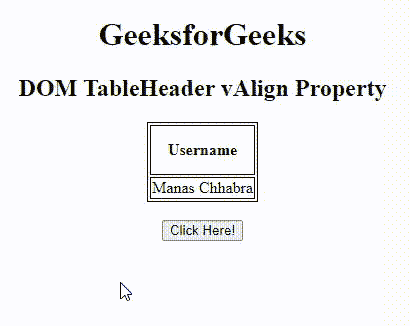
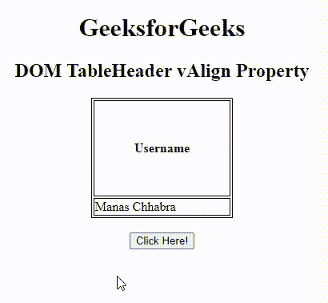

# HTML DOM 表格表头 vAlign 属性

> 原文:[https://www . geesforgeks . org/html-DOM-table-header-valign-property/](https://www.geeksforgeeks.org/html-dom-table-header-valign-property/)

[**HTML DOM TableHeader**](https://www.geeksforgeeks.org/html-dom-tableheader-object/)**vAlign**属性用于设置或返回第<>元素的 vAlign 属性的值。**标记**属性用于指定表格标题内文本内容的垂直对齐方式。

**注**:html 5 中不再支持该属性。

**语法:**

*   它返回表格标题值属性。

```html
TableHeaderobject.vAlign;
```

*   它设置表格标题值属性。

```html
TableHeaderobject.vAlign = "top|middle|bottom|baseline";
```

**房产价值:**

*   **顶部:**它将内容设置为顶部对齐。
*   **中:**将内容设置为中对齐。
*   **底部:**它将内容设置为底部对齐。
*   **基线:**它将上下文设置为基线。基线是大多数角色所处的位置。

**返回值:**返回一个代表表头垂直对齐的字符串值。

我们将利用上述属性值，并通过示例了解其实现。

**例 1** :下面的代码说明了如何返回 **vAlign** 属性。

## 超文本标记语言

```html
<!DOCTYPE html>
<html>

<head>

    <!-- Style to set border -->
    <style>
    table,
    th,
    td {
        border: 1px solid black;
    }
    </style>
</head>

<body>
    <h1>GeeksforGeeks</h1>
    <h2>
        DOM TableHeader vAlign Property
    </h2>
    <table>
        <tr>
            <th id="table"
                style="padding:15px"
                valign="baseline"> Username
            </th>
        </tr>
        <tr>
            <td>Manas Chhabra</td>
        </tr>
    </table>
    <br>
    <button onclick="myGeeks()"> Click Here!</button>
    <p id="sudo"
        style="font-size:25px;
               color:green"></p>

    <!-- Script to access th element -->
    <script>
    function myGeeks() {
        var tab = document.getElementById("table").vAlign;
        document.getElementById("sudo").innerHTML = tab;
    }
    </script>
</body>

</html>
```

**输出:**



**示例 2:** 下面的 HTML 代码说明了如何设置 **vAlign** 属性。

## 超文本标记语言

```html
<!DOCTYPE html>
<html>

<head>

    <!-- Style to set border -->
    <style>
    table,
    th,
    td {
        border: 1px solid black;
    }
    </style>
</head>

<body>
    <center>
        <h1>GeeksforGeeks</h1>
        <h2>
            DOM TableHeader vAlign Property
        </h2>
        <table>
            <tr>
                <th id="table"
                    style="padding:50px"
                    valign="baseline"> Username
                </th>
            </tr>
            <tr>
                <td>Manas Chhabra</td>
            </tr>
        </table>
        <br>
        <button onclick="myGeeks()"> Click Here! </button>
        <p id="sudo"
           style="font-size:25px;
                  color:green">
        </p>

    </center>

    <!-- Script to access th element -->
    <script>
    function myGeeks() {
        var tab = document.getElementById(
                "table").vAlign = "bottom";
        document.getElementById("sudo").innerHTML = tab;
    }
    </script>
</body>

</html>
```

**输出:**



**支持的浏览器:**

*   谷歌 Chrome
*   火狐浏览器
*   微软边缘
*   歌剧
*   旅行队
*   微软公司出品的 web 浏览器