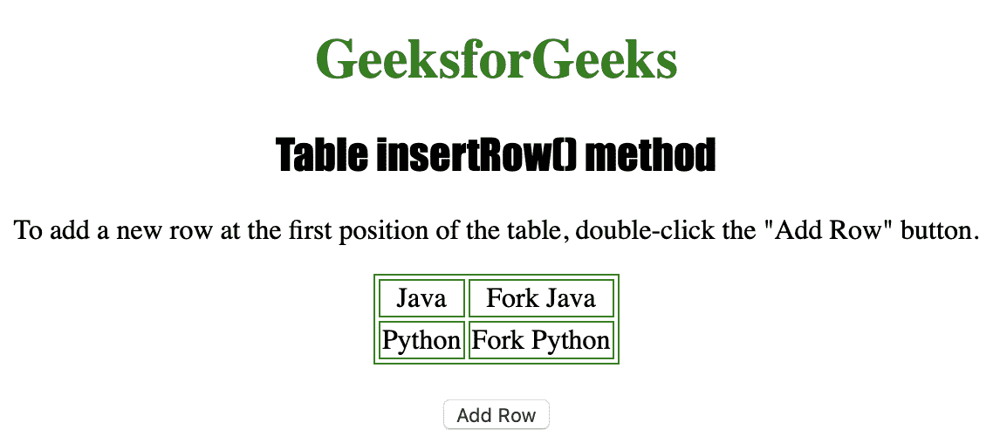
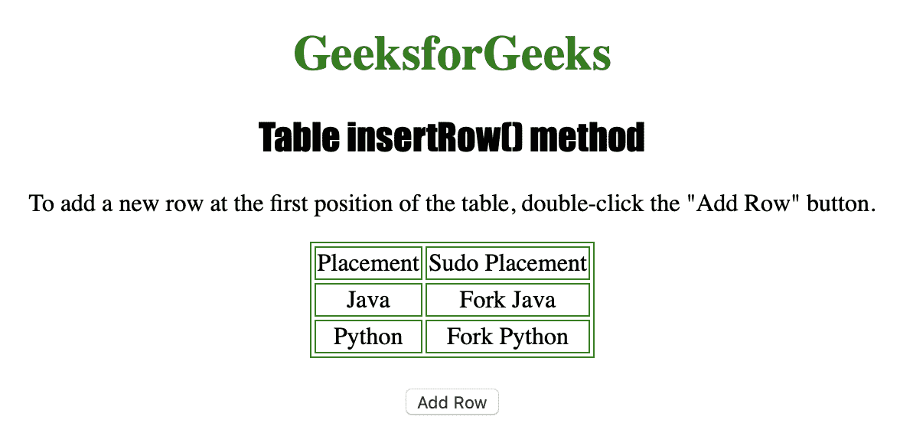

# HTML | DOM 表格 insertRow()方法

> 原文:[https://www . geesforgeks . org/html-DOM-table-insert row-method/](https://www.geeksforgeeks.org/html-dom-table-insertrow-method/)

**表格插入行()方法**用于创建一个空的 **< tr >** 一个可以添加到表格中的元素。
通常用于在表中的指定索引处插入新行。
一个< tr >元素包含至少一个< th >或< td >元素。
**语法**

```html
tableObject.insertRow(index)
```

**使用的参数**

*   **索引:**用于指定要插入的行的位置。值 0 导致在第一个位置插入新行，而-1 可用于在最后一个位置插入新行。

**返回值:**返回插入的< tr >元素

下面的程序说明了 Table insertRow()方法:
**示例-1:** 在表格的第一个位置插入新行。

## 超文本标记语言

```html
<!DOCTYPE html>
<html>

<head>
    <title>Table insertRow() method in HTML</title>
    <style>
        table,
        td {
            border: 1px solid green;
        }

        h1 {
            color: green;
        }

        h2 {
            font-family: Impact;
        }

        body {
            text-align: center;
        }
    </style>
</head>

<body>

    <h1>GeeksforGeeks</h1>
    <h2>Table insertRow() method</h2>

<p>To add a new row at the first
      position of the table, double-click
      the "Add Row" button.</p>

    <table id="Courses"
           align="center">
        <tr>
            <td>Java</td>
            <td>Fork Java</td>
        </tr>
        <tr>
            <td>Python</td>
            <td>Fork Python</td>
        </tr>
    </table>
    <br>

    <button ondblclick="row()">
      Add Row
  </button>

    <script>
        function row() {

            var MyTable =
                document.getElementById("Courses");

            // insert new row.
            var NewRow = MyTable.insertRow(0);
            var Newcell1 = NewRow.insertCell(0);
            var Newcell2 = NewRow.insertCell(1);
            Newcell1.innerHTML = "Placement";
            Newcell2.innerHTML = "Sudo Placement";
        }
    </script>

</body>

</html>
```

**输出:**



**点击**按钮后



**支持的浏览器:**

*   苹果 Safari
*   微软公司出品的 web 浏览器
*   火狐浏览器
*   谷歌 Chrome
*   歌剧