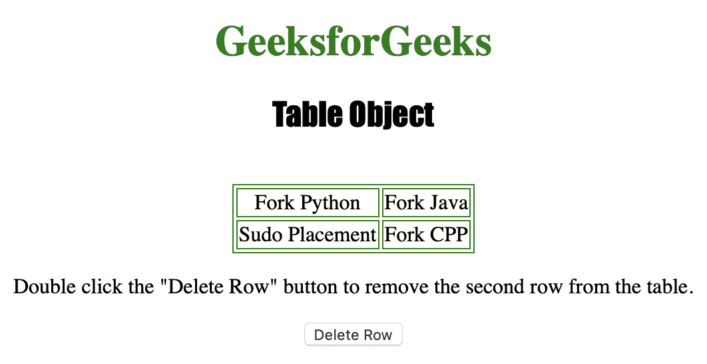
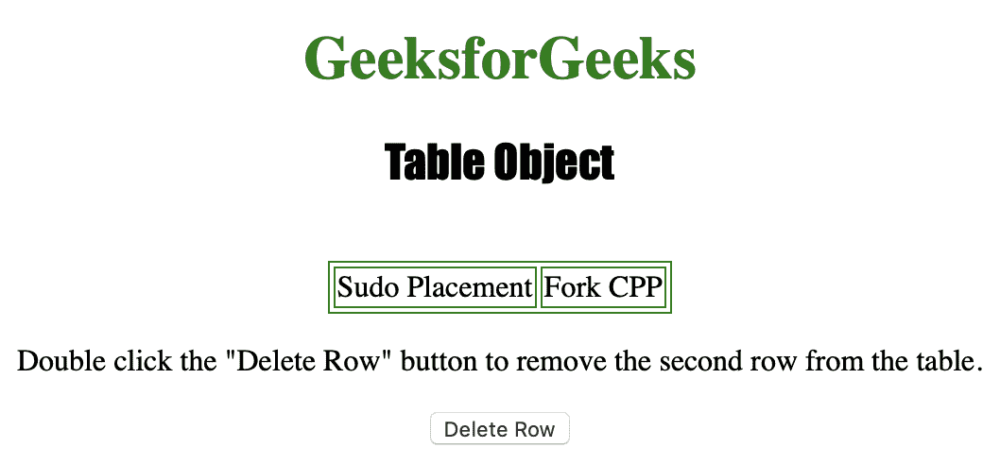
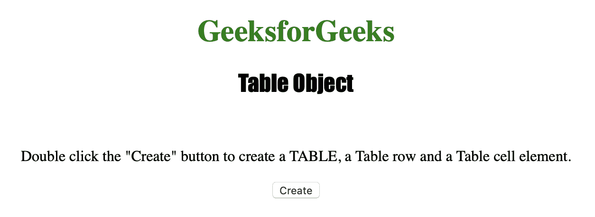
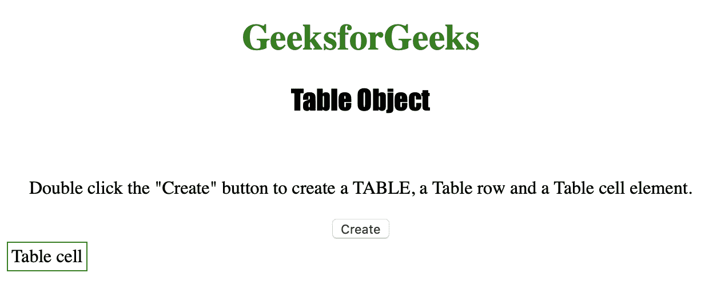

# HTML | DOM 表格对象

> 原文:[https://www.geeksforgeeks.org/html-dom-table-object/](https://www.geeksforgeeks.org/html-dom-table-object/)

**表格对象**用于表示一个 HTML [<表格>](https://www.geeksforgeeks.org/html-tables/) 元素。它可以用来创建和访问一个表。

**语法:**

*   **访问表格元素。:**

    ```html
    document.getElementById("id");
    ```

*   **创建表格对象:**

    ```html
    document.createElement("TABLE");
    ```

下面的程序说明了表格对象:

**示例-1:** 使用 **getElementById()** 方法访问 **<表>** 元素。

```html
<!DOCTYPE html>
<html>

<head>
    <title>Table Object in HTML</title>
    <style>
        table,
        td {
            border: 1px solid green;
        }

        h1 {
            color: green;
        }

        h2 {
            font-family: Impact;
        }

        body {
            text-align: center;
        }
    </style>
</head>

<body>

    <h1>GeeksforGeeks</h1>
    <h2>Table Object</h2>
    <br>

    <table id="table" align="center">
        <tr>
            <td>Fork Python</td>
            <td>Fork Java</td>
        </tr>
        <tr>
            <td>Sudo Placement</td>
            <td>Fork CPP</td>
        </tr>
    </table>

    <p>Double click the "Delete Row" 
      button to remove the second row from the table.</p>

    <button onclick="delete()">Delete Row</button>

    <script>
        function delete() {

            // Accessing table object.
            var x = document.getElementById("table");
            x.deleteRow(0);
        }
    </script>

</body>

</html>
```

**输出:**
**点击按钮前:**


**点击按钮后:**


**示例-2:** 使用 **document.createElement()** 方法创建 **<表>** 元素。

```html
<!DOCTYPE html>
<html>

<head>
    <title>Table Object in HTML</title>
    <style>
        table {
            border: 1px solid green;
        }

        h1 {
            color: green;
        }

        h2 {
            font-family: Impact;
        }

        body {
            text-align: center;
        }
    </style>
</head>

<body>

    <h1>GeeksforGeeks</h1>
    <h2>Table Object</h2>
    <br>

    <p>Double click the "Create" button to create a 
      TABLE, a Table row and a Table cell element.</p>

    <button ondblclick="create()">Create</button>

    <script>
        function create() {

            // Create table object.
            var a = document.createElement("TABLE");
            a.setAttribute("id", "MyTable");
            document.body.appendChild(a);

            var b = document.createElement("TR");
            b.setAttribute("id", "MyTr");
            document.getElementById("MyTable").appendChild(b);

            var c = document.createElement("TD");
            var d = document.createTextNode("Table cell");
            c.appendChild(d);
            document.getElementById("MyTr").appendChild(c);
        }
    </script>

</body>

</html>
```

**输出:**
**点击按钮前:**


**点击按钮后:**


**支持的浏览器:**

*   歌剧
*   微软公司出品的 web 浏览器
*   谷歌 Chrome
*   火狐浏览器
*   苹果 Safari