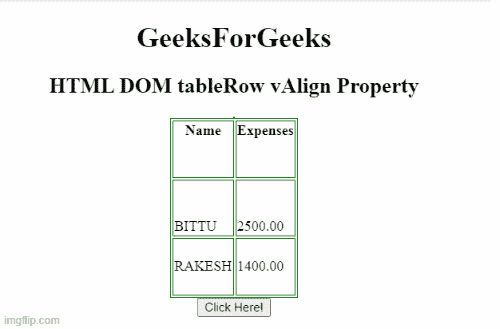

# HTML DOM 表格行 vAlign 属性

> 原文:[https://www . geesforgeks . org/html-DOM-table-row-valign-property/](https://www.geeksforgeeks.org/html-dom-table-row-valign-property/)

**HTML DOM 表格行 vAlign 属性**用于设置或返回< tr >元素的 **valign** 属性的值。**标记**属性用于指定表格行内文本内容的垂直对齐方式。

**语法**

它返回带有 vAlign 属性的表 Ro **。**

```html
TableRowobject.vAlign;
```

它设置表行值属性。

```html
TableRowobject.vAlign = "top|middle|bottom|baseline";
```

**属性值:**

*   **顶部:**它将内容设置为顶部对齐。
*   **中:**将内容设置为中对齐。
*   **底部:**它将内容设置为底部对齐。
*   **基线:**它将上下文设置为基线。基线是大多数角色所处的位置。

**返回值:**返回一个代表 TableRow 元素垂直对齐方式的字符串值。

**示例 1:** 下面的代码说明了如何返回 vAlign 属性。

## 超文本标记语言

```html
<!DOCTYPE html>
<html>

<head>
    <style>
        table,
        th,
        td {
            border: 1px solid green;
        }
    </style>
</head>

<body>
    <center>
        <h1>
            GeeksForGeeks
        </h1>

        <h2>HTML DOM tableRow vAlign Property</h2>

        <table style="height:200px" border="1">
            <tr id="GFG" valign="top">
                <th>Name</th>
                <th>Expenses</th>
            </tr>

            <tr valign="bottom">
                <td>BITTU</td>
                <td>2500.00</td>
            </tr>

            <tr valign="middle">
                <td>RAKESH</td>
                <td>1400.00</td>
            </tr>
        </table>

        <button onclick="myGeeks()">
            Click Here!
        </button>

        <p id="sudo"></p>

    </center>

    <script>
        function myGeeks() {
            var row = document.getElementById("GFG").vAlign;
            document.getElementById("sudo").innerHTML = row;
        }
    </script>
</body>

</html>
```

**输出:**



**示例 2:** 下面的代码设置了 vAlign 属性。

## 超文本标记语言

```html
<!DOCTYPE html>
<html>

<head>
    <style>
        table,
        th,
        td {
            border: 1px solid green;
        }
    </style>
</head>

<body>
    <center>

        <h1>
            GeeksForGeeks
        </h1>

        <h2>HTML DOM tableRow vAlign Property</h2>

        <table style="height:200px" border="1">
            <tr id="GFG" valign="top">
                <th>Name</th>
                <th>Expenses</th>
            </tr>

            <tr valign="bottom">
                <td>BITTU</td>
                <td>2500.00</td>
            </tr>

            <tr valign="middle">
                <td>RAKESH</td>
                <td>1400.00</td>
            </tr>
        </table>

        <button onclick="myGeeks()">
            Click Here!
        </button>

        <p id="sudo"></p>

    </center>

    <script>
        function myGeeks() {
            var row = document.getElementById(
                      "GFG").vAlign = "bottom";
            document.getElementById("sudo").innerHTML = row;
        }
    </script>
</body>

</html>
```

**输出**


**支持的浏览器:**

*   谷歌 Chrome
*   微软公司出品的 web 浏览器
*   歌剧
*   火狐浏览器
*   苹果 Safari