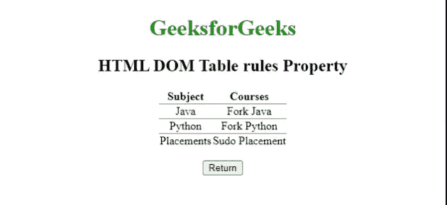
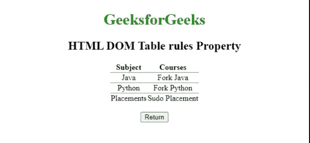

# HTML DOM 表格规则属性

> 原文:[https://www . geesforgeks . org/html-DOM-table-rules-property/](https://www.geeksforgeeks.org/html-dom-table-rules-property/)

**HTML DOM Table 规则**属性用于设置或返回 ***规则*** 属性的 [<表>](https://www.geeksforgeeks.org/html-tables/) 标记的值。*规则*属性用于定义边框的哪个部分应该可见。

**语法**

它返回*规则*属性。

```html
tableObject.rules;
```

用于设置属性的*规则*。

```html
tableObject.rules="values";
```

**属性值:**

*   **无:**不创建任何线条。
*   **组:**在行组和列组之间创建线条。
*   **行:**它在行之间创建行。
*   **列:**它在列之间创建线条。
*   **all:** 在行和列之间创建线条。

**示例 1:** 下面的 HTML 代码返回表*规则*属性。

## 超文本标记语言

```html
<!DOCTYPE html>
<html>

<head>
    <style>
        h1 {
            color: green;
        }

        body {
            text-align: center;
        }
    </style>
</head>

<body>
    <h1>GeeksforGeeks</h1>
    <h2>HTML DOM Table rules Property</h2>

    <table id="tableID" align="center" rules="rows" 
        summary="courses@GeeksforGeeks" frame="void">
        <thead>
            <tr>
                <th>Subject</th>
                <th>Courses</th>
            </tr>
        </thead>
        <tr>
            <td>Java</td>
            <td>Fork Java</td>
        </tr>
        <tr>
            <td>Python</td>
            <td>Fork Python</td>
        </tr>
        <tr>
            <td>Placements</td>
            <td>Sudo Placement</td>
        </tr>
    </table>
    <br>

    <button ondblclick="dblClick()">
        Return
    </button>

    <p id="paraID"></p>

    <script>
        function dblClick() {
            var w = document.getElementById("tableID").rules;
            document.getElementById("paraID").innerHTML = w;
        }
    </script>
</body>

</html>
```

**输出:**



**示例 2:** 下面的 HTML 代码说明了如何设置*规则*属性。

## 超文本标记语言

```html
<!DOCTYPE html>
<html>

<head>
    <style>
        h1 {
            color: green;
        }

        body {
            text-align: center;
        }
    </style>
</head>

<body>
    <h1>GeeksforGeeks</h1>
    <h2>HTML DOM Table rules Property</h2>

    <table id="tableID" align="center" rules="rows" 
        summary="courses@GeeksforGeeks" frame="void">

        <thead>
            <tr>
                <th>Subject</th>
                <th>Courses</th>
            </tr>
        </thead>
        <tr>
            <td>Java</td>
            <td>Fork Java</td>
        </tr>
        <tr>
            <td>Python</td>
            <td>Fork Python</td>
        </tr>
        <tr>
            <td>Placements</td>
            <td>Sudo Placement</td>
        </tr>
    </table>
    <br>

    <button ondblclick="dblClick()">
        Return
    </button>

    <p id="paraID"></p>

    <script>
        function dblClick() {
            var w = document.getElementById(
                "tableID").rules = "cols";

            document.getElementById(
                "paraID").innerHTML = w;
        }
    </script>
</body>

</html>
```

**输出:**



**支持的浏览器**

*   谷歌 Chrome
*   微软公司出品的 web 浏览器
*   歌剧
*   苹果 Safari
*   火狐浏览器