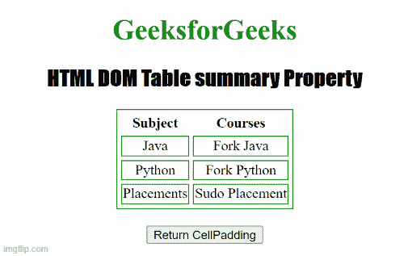

# HTML DOM 表格汇总属性

> 原文:[https://www . geesforgeks . org/html-DOM-table-summary-property/](https://www.geeksforgeeks.org/html-dom-table-summary-property/)

**HTML DOM 表格摘要属性**用于设置或返回<表格>元素的**摘要**属性的值。summary 属性用于定义表的摘要。

**语法:**

*   它用于返回“表格摘要”属性。

    ```html
    tableObject.Summary;
    ```

*   它用于设置表摘要属性。

    ```html
    tableObject.Summary="text";
    ```

**属性值:**包含单个值**，即指定表格摘要的文本**。

**示例:**下面的 HTML 代码说明了如何返回 summary 属性。

## 超文本标记语言

```html
<!DOCTYPE html>
<html>

<head>
    <title>
        Table Summary Property in HTML 
    </title>

    <style>
        table,
        td {
            border: 1px solid green;
        }

        h1 {
            color: green;
        }

        h2 {
            font-family: Impact;
        }

        body {
            text-align: center;
        }
    </style>
</head>

<body>
    <h1>GeeksforGeeks</h1>
    <h2>HTML DOM Table summary Property</h2>

    <table id="GFG" align="center" cellspacing="5" 
        summary="courses@GeeksFprGeeks">

        <thead>
            <tr>
                <th>Subject</th>
                <th>Courses</th>
            </tr>
        </thead>
        <tr>
            <td>Java</td>
            <td>Fork Java</td>
        </tr>
        <tr>
            <td>Python</td>
            <td>Fork Python</td>
        </tr>
        <tr>
            <td>Placements</td>
            <td>Sudo Placement</td>
        </tr>
    </table>
    <br>

    <button ondblclick="Table_Caption()">
        Return CellPadding
    </button>

    <p id="sudo"></p>

    <script>
        function Table_Caption() {
            var w = document.getElementById("GFG").summary;
            document.getElementById("sudo").innerHTML = w;
        }
    </script>
</body>

</html>
```

**输出:**



**支持的浏览器:**

*   谷歌 Chrome
*   歌剧
*   微软公司出品的 web 浏览器
*   火狐浏览器
*   苹果 Safari