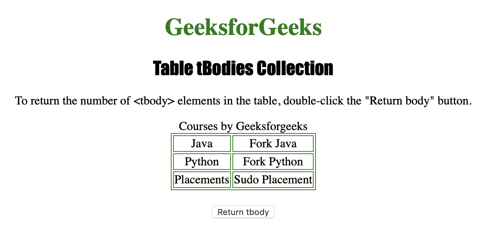

# HTML | DOM 表 tBodies 集合

> 原文:[https://www . geesforgeks . org/html-DOM-table-tbodies-collection/](https://www.geeksforgeeks.org/html-dom-table-tbodies-collection/)

**表体集合**用于返回表中所有 **<表体>** 元素的集合。 **<主体>** 元素的顺序和它们在源代码中的位置一样排序。

**语法**

```html
tableObject.tBodies
```

**属性**

*   **长度:**用于返回集合中< tbody >元素的个数。

**方法**

*   **【索引】:**用于从集合中返回具有指定索引的< tbody >元素。
*   **项(索引):**也用于从集合中返回具有指定索引的< tbody >元素。
*   **name item(id):**它也用于从集合中返回具有指定 id 的< tbody >元素。

下面的程序说明了表格行集合:
**示例:**找出表格中 **< tbody >** 元素的数量。

```html
<!DOCTYPE html>
<html>

<head>
    <title>Table tBodies Collection in HTML
  </title>
    <style>
        table,
        td {
            border: 1px solid green;
        }

        h1 {
            color: green;
        }

        h2 {
            font-family: Impact;
        }

        body {
            text-align: center;
        }
    </style>
</head>

<body>

    <h1>GeeksforGeeks</h1>
    <h2>Table tBodies Collection</h2>

    <p>To return the number of <tbody> 
      elements in the table, 
      double-click the "Return body" button.</p>

    <table id="Courses" align="center">
        <caption>Courses by Geeksforgeeks</caption>
        <tbody>
            <tr>
                <td>Java</td>
                <td>Fork Java</td>
            </tr>
        </tbody>
        <tbody>
            <tr>
                <td>Python</td>
                <td>Fork Python</td>
            </tr>
        </tbody>
        <tbody>
            <tr>
                <td>Placements</td>
                <td>Sudo Placement</td>
            </tr>
        </tbody>
    </table>
    <br>

    <button ondblclick="tr()">
      Return tbody
  </button>

    <p id="test"></p>

    <script>
        function tr() {

            // Returning tBodies element length.
            var r =
            document.getElementById("Courses").tBodies.length;

            document.getElementById("test").innerHTML =
              r + " tbody elements are present in the table.";
        }
    </script>

</body>

</html>
```

**输出:**

**点击按钮前:**


**点击按钮后:**


**支持的浏览器:**

*   苹果 Safari
*   微软公司出品的 web 浏览器
*   火狐浏览器
*   谷歌 Chrome
*   歌剧