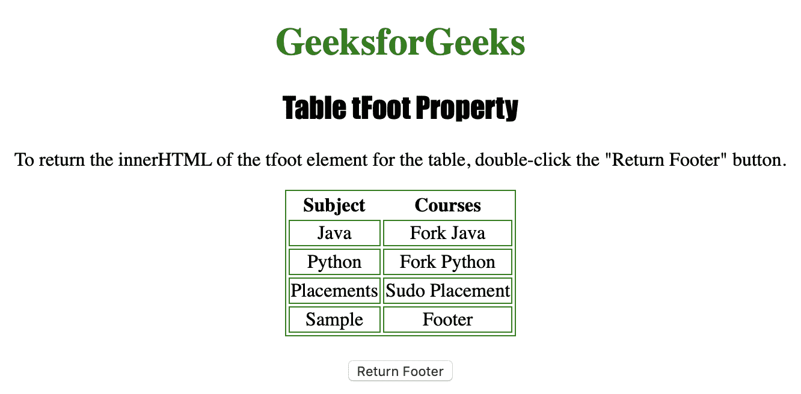
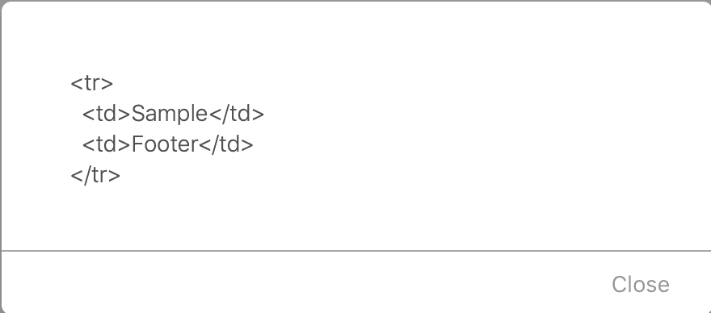

# HTML | DOM 表 tFoot 属性

> 原文:[https://www . geesforgeks . org/html-DOM-table-tfoot-property/](https://www.geeksforgeeks.org/html-dom-table-tfoot-property/)

**Table tFoot 属性**用于返回对表的 **< tfoot >** 元素的引用。< tfoot >元素用于在一个 HTML 表格中对页脚内容进行*分组。
如果 **< tfoot >** *元素未定义*，则返回**空值**。
**语法*** 

```html
tableObject.tFoot
```

**返回值:**对表中< tfoot >元素的引用，如果没有定义
则为空

下面的程序说明了 Table TFoot()属性:
**示例:**提醒 **< tfoot >** 元素的内部 HTML。

## 超文本标记语言

```html
<!DOCTYPE html>
<html>

<head>
    <title>Table tFoot Property in HTML
  </title>
    <style>
        table,
        td {
            border: 1px solid green;
        }

        h1 {
            color: green;
        }

        h2 {
            font-family: Impact;
        }

        body {
            text-align: center;
        }
    </style>
</head>

<body>

    <h1>GeeksforGeeks</h1>
    <h2>Table tFoot Property</h2>

<p>To return the innerHTML of the tfoot
      element for the table, double-click the
      "Return Footer" button.</p>

    <table id="Courses" align="center">
        <thead>
            <tr>
                <th>Subject</th>
                <th>Courses</th>
            </tr>
        </thead>
        <tr>
            <td>Java</td>
            <td>Fork Java</td>
        </tr>
        <tr>
            <td>Python</td>
            <td>Fork Python</td>
        </tr>
        <tr>
            <td>Placements</td>
            <td>Sudo Placement</td>
        </tr>
        <tfoot>
            <tr>
                <td>Sample</td>
                <td>Footer</td>
            </tr>
        </tfoot>

    </table>
    <br>

    <button ondblclick="tfoot()">
      Return Footer
  </button>

    <script>
        function tfoot() {

            // returning reference of tFoot
            // using alert
            alert(document.getElementById(
              "Courses").tFoot.innerHTML);
        }
    </script>

</body>

</html>
```

**输出:**
**点击按钮前:**



**点击按钮后:**



**支持的浏览器:**

*   谷歌 Chrome 6.0
*   Internet Explorer 10.0
*   Firefox 16.0
*   苹果 Safari 5.0
*   歌剧 10.6 歌剧