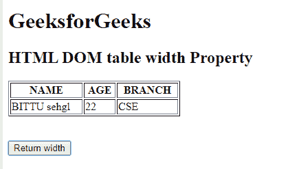
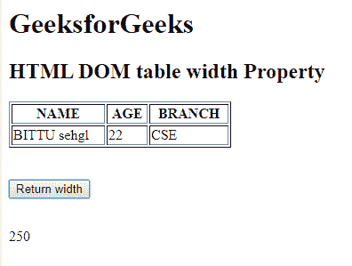
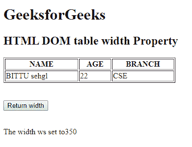

# HTML | DOM 表格宽度属性

> 原文:[https://www . geesforgeks . org/html-DOM-table-width-property/](https://www.geeksforgeeks.org/html-dom-table-width-property/)

HTML DOM 中的**表格宽度属性**用于设置或返回表格宽度属性的值。

**语法:**

*   它返回表格的宽度属性。

    ```html
    tableObject.width;
    ```

*   它用于设置表格的宽度属性。

    ```html
    tableObject.width ="pixels";
    ```

**属性值:**

*   **像素:**以像素为单位设置表格的宽度。
*   **%:** 以百分比(%)设置表格宽度。

**返回值:**返回一个代表表格元素宽度的数值。

**注意:**HTML 5 不支持。

**示例 1:** 本示例返回表格的宽度属性。

```html
<!DOCTYPE html> 
<html> 

<head> 
    <title> 
        HTML DOM table width Property 
    </title> 
</head> 

<body> 
    <h1>GeeksforGeeks</h1> 

    <h2>HTML DOM table width Property</h2> 

    <table border="1" id = "gfg" width="250"> 
        <tr> 
            <th>NAME</th> 
            <th>AGE</th> 
            <th>BRANCH</th> 
        </tr> 
        <tr> 
            <td>BITTU</td> 
            <td>22</td> 
            <td>CSE</td> 
        </tr> 
    </table> 

    <br><br>

    <button ondblclick="thead()"> 
        Return width
    </button> 

    <p id="sudo"></p>

    <script> 
        function thead() { 
            var x = 
            document.getElementById("gfg").width;

            document.getElementById("sudo").innerHTML
                        = x;
        } 
    </script> 
</body> 

</html>
```

**点击按钮前:**

**点击按钮后:**


**示例 2:** 本示例设置表格的宽度属性。

```html
<!DOCTYPE html> 
<html> 

<head> 
    <title> 
        HTML DOM table width Property 
    </title> 
</head> 

<body> 
    <h1>GeeksforGeeks</h1> 

    <h2>HTML DOM table width Property</h2> 

    <table border="1" id = "gfg" width="250"> 
        <tr> 
            <th>NAME</th> 
            <th>AGE</th> 
            <th>BRANCH</th> 
        </tr> 
        <tr> 
            <td>BITTU sehgl</td> 
            <td>22</td> 
            <td>CSE</td> 
        </tr> 
    </table> 

    <br><br>

    <button ondblclick="thead()"> 
        Return width
    </button>

    <br> <br>

    <p id="sudo"></p>

    <script> 
        function thead() { 
            var x = document.getElementById("gfg").width
                        = "350";

            document.getElementById("sudo").innerHTML
                    = "The width ws set to" + x;
        } 
    </script>
</body> 

</html>
```

**点击按钮前:**

**点击按钮后:**

**支持的浏览器:**

*   谷歌 Chrome 6.0
*   Internet Explorer 10.0
*   Firefox 16.0
*   苹果 Safari 5.0
*   歌剧 10.6 欧