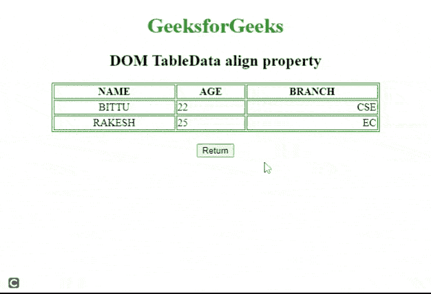
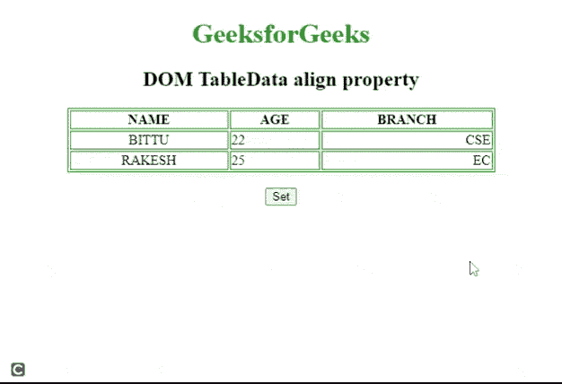

# HTML DOM TableData 对齐属性

> 原文:[https://www . geesforgeks . org/html-DOM-tabledata-align-property/](https://www.geeksforgeeks.org/html-dom-tabledata-align-property/)

**HTML DOM TableData** ***【对齐*** 属性用于设置或返回表格单元格内内容的水平对齐方式。HTML5 不支持它。

**语法:**

*   它返回*对齐*属性。

```html
TableDataobject.align
```

*   它设置*对齐*属性。

```html
TableDataObject.align = "left | right | center"
```

**属性值:**

*   **左:**设置左对齐到 TableData 单元格。
*   **居中**:设置表格数据单元格居中对齐。这是默认值。
*   **右:**设置表格数据单元格右对齐。
*   **对齐:**拉伸段落文本，使所有行的宽度相等。
*   **字符:**它将文本对齐设置为特定字符。

**返回值:**返回一个字符串值，代表 TableData 元素的对齐方式。

**示例 1:** 下面的 HTML 代码返回 TableData *align* 属性。

## 超文本标记语言

```html
<!DOCTYPE html>
<html>

<head>
    <style> 

        table,
        th,
        td 
        {
            border:1px solid green;
        }
    </style>
</head>

<body>
<center>
    <body style="text-align:center;">

        <h1 style="color:green;">
            GeeksforGeeks
        </h1>

        <h2>DOM TableData align property</h2>
         <table width="500" border="1">
            <tr>
                <th>NAME</th>
                <th>AGE</th>
                <th>BRANCH</th>
            </tr>

            <tr>
                <td align="center">BITTU</td>
                <td align="left">22</td>
                <td align="right">CSE</td>
            </tr>

            <tr>
                <td align="center">RAKESH</td>
                <td id ="columnID" align="left">25</td> 
                <td align="right">EC</td>
            </tr>
         </table>
      <br>

        <button onclick="myFunction()">
           Return
        </button>

        <p id="paraID"></p>

        <script>
            function myFunction() {
              // Accessing Table data
                var x =
                document.getElementById("columnID").align;
                document.getElementById("paraID").innerHTML = x
            }
        </script>
    </body>
</html>
```

**输出:**



**示例 2:** 下面的代码将 TableData 设置为*对齐*属性。

## 超文本标记语言

```html
<!DOCTYPE html>
<html>
<head>
    <style> 

        table,
        th,
        td {
            border: 1px solid green;
        }
    </style>
</head>

<body>
<center>
    <body style="text-align:center;">

        <h1 style="color:green;">
            GeeksforGeeks
        </h1>

        <h2>DOM TableData align property</h2>
         <table width="500" border="1">
                <tr>
                    <th>NAME</th>
                    <th>AGE</th>
                    <th>BRANCH</th>
                </tr>          
                <tr>
                    <td align="center">BITTU</td>
                    <td align="left">22</td>
                    <td align="right">CSE</td>
                </tr>          
                <tr>
                    <td align="center">RAKESH</td>
                    <td id ="columnID" align="left">25</td> 
                    <td align="right">EC</td>
                </tr>
         </table>
        <br>

        <button onclick="btnclick()">
          Set
        </button>

        <p id="paraID"></p>

        <script>
            function btnclick() {
            // Accessing Table data
             var x =
                document.getElementById("columnID").align = "right";
                document.getElementById("paraID").innerHTML = x
            }
        </script>
    </body>
</html>
```

**输出:**



**支持的浏览器:**HTML DOM TableData align 属性支持的浏览器如下:

*   谷歌 Chrome
*   微软公司出品的 web 浏览器
*   火狐浏览器
*   旅行队
*   歌剧