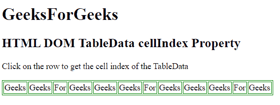
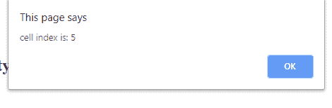

# HTML | DOM TableData 单元格索引属性

> 原文:[https://www . geesforgeks . org/html-DOM-tabledata-cell index-property/](https://www.geeksforgeeks.org/html-dom-tabledata-cellindex-property/)

**TableData 单元格索引属性**用于返回表格行的单元格集合中单元格的位置。

**语法:**

*   它返回单元格索引属性。

    ```
    tabledataObject.cellIndex 
    ```

**返回值:**返回一个数值，代表表格行单元格集合中单元格的位置

**示例:**

```
<!DOCTYPE html> 
<html> 

<head> 
    <style> 
        table, th, td { 
            border: 1px solid green; 

        } 
    </style> 
</head> 

<body> 

    <h1> 
        GeeksForGeeks 
    </h1> 

    <h2>HTML DOM TableData cellIndex Property</h2> 
    <p> 
        Click on the row to get the cell index of the TableData
    </p>
    <table> 
        <tr> 
            <td id = "GFG" onclick="myGeeks(this)">Geeks</td> 
            <td>Geeks</td> 
            <td id = "GFG" onclick="myGeeks(this)">For</td> 
            <td id = "GFG" onclick="myGeeks(this)">Geeks</td>
            <td id = "GFG" onclick="myGeeks(this)">Geeks</td> 
            <td id = "GFG" onclick="myGeeks(this)">Geeks</td> 
            <td id = "GFG" onclick="myGeeks(this)">For</td> 
            <td id = "GFG" onclick="myGeeks(this)">Geeks</td> 
            <td id = "GFG" onclick="myGeeks(this)">Geeks</td> 
            <td id = "GFG" onclick="myGeeks(this)">Geeks</td> 
            <td id = "GFG" onclick="myGeeks(this)">For</td> 
            <td id = "GFG" onclick="myGeeks(this)">Geeks</td> 
        </tr> 
    </table> 

    <p id = "sudo"></p>

    <script> 
    function myGeeks(x) {
        alert("cell index is: " + x.cellIndex);
}
</script>
    </script> 
</body> 

</html>
```

**输出:**
**点击表格单元格前:**

**点击表格单元格后:**


**支持的浏览器:****DOM TableData cell index Property**支持的浏览器如下:

*   谷歌 Chrome
*   微软公司出品的 web 浏览器
*   火狐浏览器
*   苹果 Safari
*   歌剧