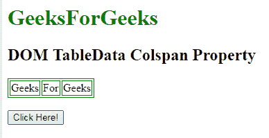
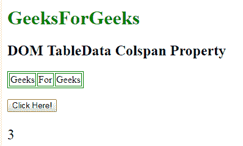
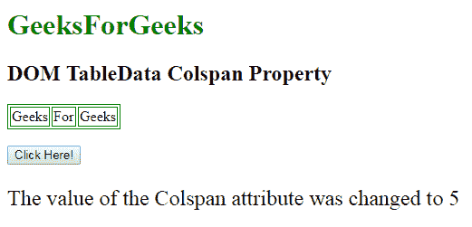

# HTML | DOM TableData colSpan 属性

> 原文:[https://www . geesforgeks . org/html-DOM-tabledata-col span-property/](https://www.geeksforgeeks.org/html-dom-tabledata-colspan-property/)

HTML DOM 中的 **Dom TableData colSpan 属性**用于**设置**或**返回***colSpan 属性*的值。 **colspan 属性**用于指定表格应该跨越的列数。

**语法:**

*   它返回 colSpan 属性。

```html
tabledataObject.colSpan
```

*   它用于设置 colSpan 属性。

```html
tabledataObject.colSpan = number
```

**属性值:**它包含指定单元格应该跨越的列数的数值。

**返回值:**返回一个数值，代表单元格应该跨越的列数。

**示例-1:** 本示例返回 colspan 属性。

## 超文本标记语言

```html
<!DOCTYPE html>
<html>

<head>
    <style>
        table,
        th,
        td {
            border: 1px solid green;
        }
    </style>
</head>

<body>

    <body>

        <h1 style="color:green;">
            GeeksForGeeks
        </h1>

        <h2>
          DOM TableData Colspan Property
      </h2>

        <table>
            <tr>
                <td id="myTd"
                    colspan="3">
                  Geeks
              </td>
                <td>For</td>
                <td>Geeks</td>
            </tr>
        </table>
        <br>
        <button onclick="myFunction()">
            Click Here!
        </button>

        <p id="demo"
           style="font-size:24px;
                  colorgreen;">
      </p>

        <script>
            function myFunction() {
                // Accessing Table data
                var x =
                    document.getElementById(
                      "myTd").colSpan;
                document.getElementById("demo").innerHTML = x;
            }
        </script>
    </body>

</html>
```

**输出:**
**点击按钮前:**



**点击按钮后:**



**示例-2:** 本示例设置 colspan 属性。

## 超文本标记语言

```html
<!DOCTYPE html>
<html>

<head>
    <style>
        table,
        th,
        td {
            border: 1px solid green;
        }
    </style>
</head>

<body>

    <body>

        <h1 style="color:green;">
            GeeksForGeeks
        </h1>

        <h2>
          DOM TableData Colspan Property
      </h2>

        <table>
            <tr>
                <td id="myTd"
                    colSpan="3">
                  Geeks
              </td>
                <td>For</td>
                <td>Geeks</td>
            </tr>
        </table>
        <br>
        <button onclick="myFunction()">
            Click Here!
        </button>

        <p id="demo"
           style="font-size:24px;
                  colorgreen;">
      </p>

        <script>
            function myFunction() {
                // Accessing Table data
                var x =
                    document.getElementById("myTd").colSpan = "5";

                document.getElementById("demo").innerHTML =
                  "The value of the Colspan "+
                  "attribute was changed to "
                + x;
            }
        </script>
    </body>

</html>
```

**输出:**
**点击按钮前:**


**点击按钮后:**



**支持的浏览器:**

*   谷歌 Chrome
*   Mozilla Firefox
*   边缘
*   歌剧
*   旅行队