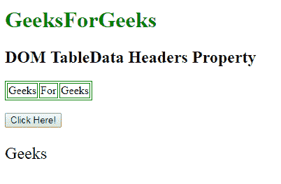

# HTML | DOM TableData 表头属性

> 原文:[https://www . geesforgeks . org/html-DOM-tabledata-headers-property/](https://www.geeksforgeeks.org/html-dom-tabledata-headers-property/)

**HTML | DOM TableData 表头属性**用于**设置**或**返回** *表头属性*的值。**表头属性**用于指定包含当前数据单元格表头信息的表格单元格。
**语法:**

*   它返回 headers 属性。

```html
tabledataObject.headers
```

*   它用于设置 headers 属性。

```html
tabledataObject.headers = header_ids
```

**属性值:**它包含值，即**标题 _ id**，指定一个或多个标题单元格的单独 id 列表。
**返回值:**返回一个字符串值，代表标题列表标识的分隔列表。
**示例-1:** 本示例返回一个标题属性。

## 超文本标记语言

```html
<!DOCTYPE html>
<html>

<head>
    <style>
        table,
        th,
        td {
            border: 1px solid green;
        }
    </style>
</head>

<body>

    <h1 style="color:green;">
            GeeksForGeeks
        </h1>

    <h2>
          DOM TableData Headers Property
      </h2>

    <table>
        <tr>
            <td id="myTd"
                headers="Geeks"
                colspan="3">
                Geeks
            </td>
            <td>For</td>
            <td>Geeks</td>
        </tr>
    </table>
    <br>
    <button onclick="myFunction()">
        Click Here!
    </button>

    <p id="demo"
       style="font-size:24px;
                  colorgreen;">
    </p>

    <script>
        function myFunction() {
            // Accessing Table data
            var x =
                document.getElementById(
                    "myTd").headers;

            document.getElementById("demo").innerHTML =
                x;
        }
    </script>
</body>

</html>
```

**输出:**
**点击按钮前:**


**点击按钮后:**



**示例-2:** 本示例设置标题的属性。

## 超文本标记语言

```html
<!DOCTYPE html>
<html>

<head>
    <style>
        table,
        th,
        td {
            border: 1px solid green;
        }
    </style>
</head>

<body>

    <h1 style="color:green;">
            GeeksForGeeks
        </h1>

    <h2>
          DOM TableData Headers Property
      </h2>

    <table>
        <tr>
            <td id="myTd"
                headers="Geeks"
                colspan="3">
              Geeks
          </td>
            <td>For</td>
            <td>Geeks</td>
        </tr>
    </table>
    <br>
    <button onclick="myFunction()">
        Click Here!
    </button>

    <p id="demo"
       style="font-size:24px;
                  colorgreen;">
    </p>

    <script>
        function myFunction() {
            // Accessing Table data
            var x =
                document.getElementById(
                    "myTd").headers = "GFG";

            document.getElementById("demo").innerHTML =
                "The value od the headers attribute was changed to "
            + x;
        }
    </script>
</body>

</html>
```

**输出:**
**点击按钮前:**


**点击按钮后:**


**支持的浏览器:**

*   谷歌 Chrome

*   Mozilla Firefox

*   边缘

*   狩猎

*   歌剧