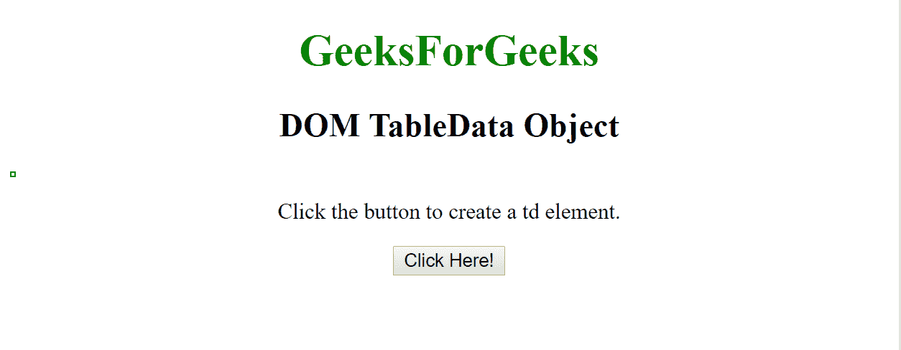

# html \ DOM 表数据对象

> 原文:[https://www.geeksforgeeks.org/html-dom-tabledata-object/](https://www.geeksforgeeks.org/html-dom-tabledata-object/)

HTML DOM 中的 TableData 对象用于表示 HTML td 元素。td 元素可以通过使用 getElementById()方法来访问。

**语法:**

*   **访问 td 元素:**

```html
document.getElementById("id");
```

*   **创建 td 元素:**

```html
document.createElement("td");
```

**TableData 对象属性:**

<figure class="table">

| attribute | describe |
| abbreviate | This property is used to set or return the value of the abbreviated property. |
| align | This property is used to set or return the horizontal alignment of contents in data cells. |
|  | This property is used to set or return the vertical alignment of the contents in the cell. |
| width | This property is used to set or return the width of a data cell. |
| axis | This property is used to set or return a comma-separated list of related data cells. |
| background | This property is used to set or return the background image of a data cell. |
| bgcolor(bgcolor) | This property is used to set or return the background color of the table. |
| 细胞指数 | This property is used to return the position of a cell in the cell collection of a table row. |
| 荣誉勋爵 | This property is used to set or return the alignment characters of data cells. |
| 乔夫 | This property is used to set or return the horizontal offset of the ch property. |
| colSpan | This property is used to set or return the value of colSpan property. |
| meter | This property is used to set or return the value of the header property. |
| height | This property is used to set or return the height of the data cell. |
| noWrap | This property is used to set or return whether cell contents can wrap. |
| 行跨度 | This property is used to set or return the value of the row span property. |

</figure>

**示例-1:** 访问表格数据并添加新内容。

## 超文本标记语言

```html
<!DOCTYPE html>
<html>

<head>
    <style>
        table,
        th,
        td {
            border: 1px solid green;
        }
    </style>
</head>

<body>

    <body style="text-align:center;">

        <h1 style="color:green;"> 
            GeeksForGeeks 
        </h1>

        <h2>DOM TableData Object</h2>

        <table>
            <tr>
                <td id="myTd">Geeks</td>
                <td>For</td>
                <td>Geeks</td>
            </tr>
        </table>

<p>Click the button to change the
          text of the first td element.</p>

        <button onclick="myFunction()">
          Click Here!
        </button>

        <p id="demo"></p>

        <script>
            function myFunction() {
            //  Accessing Table data
              var x =
                document.getElementById("myTd");
                x.innerHTML = "Add new content";
            }
        </script>

    </body>

</html>
```

**输出:**
**之前点击按钮:**


**点击按钮后:**


**示例-2:** 使用**文档创建 td 元素。**。

## 超文本标记语言

```html
<!DOCTYPE html>
<html>

<head>
    <style>
        table,
        th,
        td {
            border: 1px solid green;
        }
    </style>
</head>

    <body style="text-align:center;">

        <h1 style="color:green;"> 
            GeeksForGeeks 
        </h1>

        <h2>DOM TableData Object</h2>

        <table id="myTable">
            <tr id="myTr">
            </tr>
        </table>

<p>Click the button to create a td element.</p>

        <button onclick="myFunction()">
          Click Here!
        </button>

        <script>
            function myFunction() {

                //  Creating td element.
                var x =
                document.createElement("TD");

                var t =
                document.createTextNode("Hello Geeks!");

                x.appendChild(t);
                document.getElementById(
                  "myTr").appendChild(x);
            }
        </script>

    </body>

</html>
```

**输出:**
**之前点击按钮:**



**点击按钮后:**


**注意:**html 5 中不支持的大部分属性。

**支持的浏览器:**

*   谷歌 Chrome
*   边缘
*   Mozilla Firefox
*   歌剧
*   旅行队