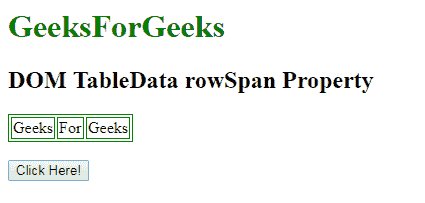
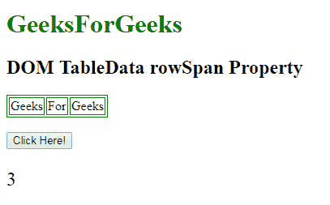
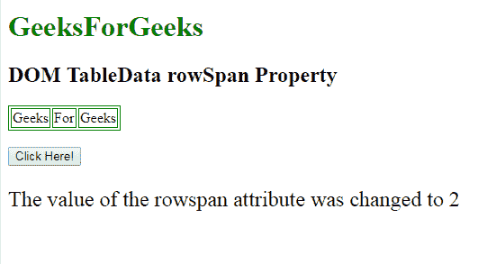

# HTML | DOM TableData rowSpan 属性

> 原文:[https://www . geesforgeks . org/html-DOM-tabledata-row span-property/](https://www.geeksforgeeks.org/html-dom-tabledata-rowspan-property/)

HTML DOM 中的 **DOM TableData rowSpan 属性**用于**设置**或**返回***row span 属性*的值。HTML 中的 rowspan 属性指定单元格应该跨越的行数。

**语法:**

*   它返回 rowSpan 属性。

```html
tabledataObject.rowSpan
```

*   它用于设置 rowSpan 属性。

```html
tabledataObject.rowSpan = number
```

**属性值:**它包含值，即**数**，指定单元格应跨越的行数。
**返回值:**返回一个数值，代表单元格应该跨越的行数。

**示例-1:** 本示例返回一个 rowspan 属性。

## 超文本标记语言

```html
<!DOCTYPE html>
<html>

<head>
    <style>
        table,
        th,
        td {
            border: 1px solid green;
        }
    </style>
</head>

<body>

    <h1 style="color:green;">
            GeeksForGeeks
        </h1>

    <h2>
          DOM TableData rowSpan Property
      </h2>

    <table>
        <tr>
            <td id="myTd"
                rowspan="3">
                Geeks
            </td>
            <td>For</td>
            <td>Geeks</td>
        </tr>
    </table>
    <br>
    <button onclick="myFunction()">
        Click Here!
    </button>

    <p id="demo" style="font-size:24px;
                  colorgreen;">
    </p>

    <script>
        function myFunction() {
            // Accessing Table data
            var x =
                document.getElementById(
                    "myTd").rowSpan;

            document.getElementById(
              "demo").innerHTML = x;
        }
    </script>
</body>

</html>
```

**输出:**
**点击按钮前:**



**点击按钮后:**



**示例-2:** 本示例设置 rowspan 属性。

## 超文本标记语言

```html
<!DOCTYPE html>
<html>

<head>
    <style>
        table,
        th,
        td {
            border: 1px solid green;
        }
    </style>
</head>

<body>

    <body>

        <h1 style="color:green;">
            GeeksForGeeks
        </h1>

        <h2>
          DOM TableData rowSpan Property
      </h2>

        <table>
            <tr>
                <td id="myTd"
                    rowspan="3">
                  Geeks
              </td>
                <td>For</td>
                <td>Geeks</td>
            </tr>
        </table>
        <br>
        <button onclick="myFunction()">
            Click Here!
        </button>

        <p id="demo"
           style="font-size:24px;
                  colorgreen;">
      </p>

        <script>
            function myFunction() {
                // Accessing Table data
                var x =
                    document.getElementById(
                    "myTd").rowSpan = "2";

                document.getElementById("demo").innerHTML =
                  "The value of the rowspan "+
                   "attribute was changed to "
                + x;
            }
        </script>
    </body>

</html>
```

**输出:**
**点击按钮前:**


**点击按钮后:**



**支持的浏览器:**

*   谷歌 Chrome
*   Mozilla Firefox
*   边缘
*   旅行队
*   歌剧