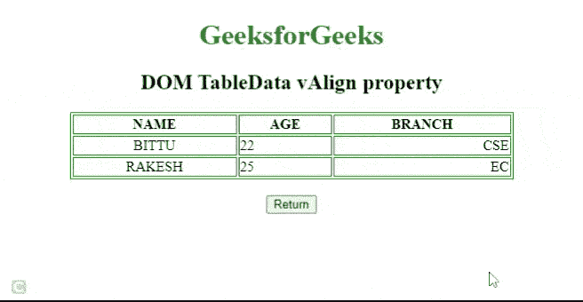
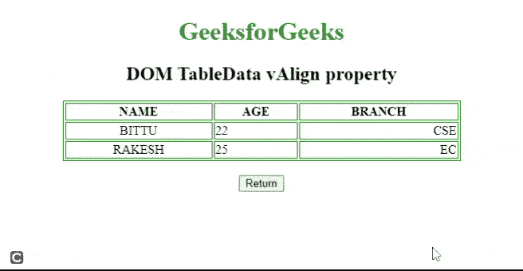

# HTML DOM TableData vAlign 属性

> 原文:[https://www . geesforgeks . org/html-DOM-tabledata-valign-property/](https://www.geeksforgeeks.org/html-dom-tabledata-valign-property/)

**HTML DOM TableData*****vAlign***属性用于设置或返回 [< td >](https://www.geeksforgeeks.org/html-td-tag/) 元素的 *vAlign* 属性的值。*标记*属性用于指定表格数据单元格内文本内容的垂直对齐方式。

**注意:**html 5 中不再支持该属性。

**语法:**

*   它返回表数据*值*属性。

```html
TableDataobject.vAlign;
```

*   设置表格数据*值*属性。

```html
TableDataobject.vAlign = "top|middle|bottom|baseline"; 
```

**属性值:**

*   **顶部:**它将内容设置为顶部对齐。
*   **中:**将内容设置为中对齐。
*   **底部:**它将内容设置为底部对齐。
*   **基线:**它将上下文设置为基线。基线是大多数角色所处的位置。

**返回值:**它返回一个字符串值，该值表示

element.

**示例 1:** 下面的代码返回表数据 *vAlign* 属性。

## 超文本标记语言

```html
<!DOCTYPE html>
<html>

<head>
    <style>
        table,
        th,
        td {
            border: 1px solid green;
        }
    </style>
</head>

<body style="text-align:center;">
    <center>
        <h1 style="color:green;">
            GeeksforGeeks
        </h1>

        <h2>DOM TableData vAlign property</h2>

        <table width="500" border="1">
            <tr>
                <th>NAME</th>
                <th>AGE</th>
                <th>BRANCH</th>
            </tr>

            <tr>
                <td align="center">BITTU</td>
                <td align="left">22</td>
                <td align="right">CSE</td>
            </tr>

            <tr>
                <td align="center">RAKESH</td>
                <td id="columnID" align="left" 
                    valign="top">25</td>
                <td align="right">EC</td>
            </tr>
        </table>
        <br>

        <button onclick="btnclick()">
            Return
        </button>

        <p id="paraID"></p>
    </center>

    <script>
        function btnclick() {

            // Accessing Table data
            var x = document.getElementById(
                    "columnID").vAlign;

            document.getElementById(
                    "paraID").innerHTML = x
        }
    </script>
</body>

</html>
```

**输出:**



**示例 2:** 下面的 HTML 代码演示了如何设置 *vAlign* 属性。

## 超文本标记语言

```html
<!DOCTYPE html>
<html>

<head>
    <style>
        table,
        th,
        td {
            border: 1px solid green;
        }
    </style>
</head>

<body style="text-align:center;">
    <center>
        <h1 style="color:green;">
            GeeksforGeeks
        </h1>

        <h2>DOM TableData vAlign property</h2>

        <table width="500" border="1">
            <tr>
                <th>NAME</th>
                <th>AGE</th>
                <th>BRANCH</th>
            </tr>

            <tr>
                <td align="center">BITTU</td>
                <td align="left">22</td>
                <td align="right">CSE</td>
            </tr>

            <tr>
                <td align="center">RAKESH</td>
                <td id="columnID" align="left" 
                    valign="top">25</td>
                <td align="right">EC</td>
            </tr>
        </table>
        <br>

        <button onclick="btnclick()">
            Return
        </button>

        <p id="paraID"></p>
    </center>

    <script>
        function btnclick() {

            // Accessing Table data
            var x =
                document.getElementById(
                    "columnID").vAlign = "bottom";

            document.getElementById(
                    "paraID").innerHTML = x
        }
    </script>
</body>

</html>
```

**输出:**



**支持的浏览器:**HTML DOM TableData*vAlign*属性支持的浏览器如下。

*   谷歌 Chrome
*   微软公司出品的 web 浏览器
*   火狐浏览器
*   旅行队
*   歌剧