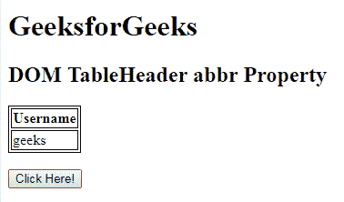
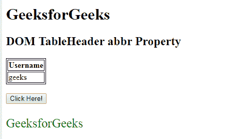
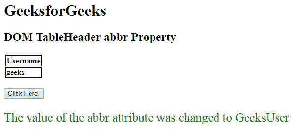

# HTML | DOM TableHeader 缩写属性

> 原文:[https://www . geesforgeks . org/html-DOM-table header-缩写-property/](https://www.geeksforgeeks.org/html-dom-tableheader-abbr-property/)

**DOM TableHeader 缩写属性**用于**设置**或**返回** *缩写属性*的值。**缩写**属性用于指定标题单元格中内容的较短版本。
在普通网页浏览器上没有视觉效果，可以供屏幕阅读器使用。

**语法:**

*   它返回缩写属性。

    ```html
    tableheaderObject.abbr
    ```

*   它用于设置缩写属性。

    ```html
    tableheaderObject.abbr = text
    ```

**属性值:**它包含值，即**文本**，指定标题内容单元格的较短描述。

**返回值:**返回一个字符串值，代表标题内容单元格的较短描述。

**示例-1:** 本示例返回一个**缩写属性**。

```html
<!DOCTYPE html>
<html>

<head>

    <!-- style to set border -->
    <style>
        table,
        th,
        td {
            border: 1px solid black;
        }
    </style>
</head>

<body>

    <h1>GeeksforGeeks</h1>

    <h2>
      DOM TableHeader abbr Property
  </h2>

    <table>
        <tr>
            <th id="table" 
                abbr="GeeksforGeeks">
              Username
          </th>
        </tr>

        <tr>
            <td>geeks</td>
        </tr>
    </table>
    <br>
    <button onclick="myGeeks()">
        Click Here!
    </button>
    <p id="sudo"
       style="font-size:25px;
              color:green">
  </p>
    <!-- Script to access th element -->
    <script>
        function myGeeks() {
            var tab = document.getElementById(
              "table").abbr;
            document.getElementById(
              "sudo").innerHTML = tab;
        }
    </script>
</body>

</html>
```

**输出:**
**点击按钮前:**


**点击按钮后:**


**示例-2:** 本示例设置**缩写属性**。

```html
<!DOCTYPE html>
<html>

<head>

    <!-- style to set border -->
    <style>
        table,
        th,
        td {
            border: 1px solid black;
        }
    </style>
</head>

<body>

    <h1>GeeksforGeeks</h1>

    <h2>
      DOM TableHeader abbr Property
  </h2>

    <table>
        <tr>
            <th id="table" 
                abbr="GeeksforGeeks">
              Username
          </th>
        </tr>

        <tr>
            <td>geeks</td>
        </tr>
    </table>
    <br>
    <button onclick="myGeeks()">
        Click Here!
    </button>
    <p id="sudo" 
       style="font-size:25px;
              color:green">
  </p>
    <!-- Script to access th element -->
    <script>
        function myGeeks() {
            var tab = document.getElementById(
              "table").abbr = "GeeksUser";

            document.getElementById(
              "sudo").innerHTML =
              "The value of the abbr attribute was changed to "
            + tab;
        }
    </script>
</body>

</html>
```

**输出:**
**点击按钮前:**


**点击按钮后:**


**支持的浏览器:**

*   谷歌 Chrome
*   Internet Explorer 10.0+
*   歌剧
*   苹果 Safari
*   Mozilla Firefox