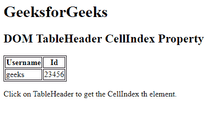
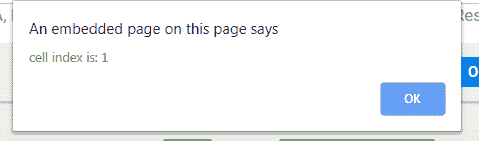

# HTML | DOM TableHeader 单元格索引属性

> 原文:[https://www . geesforgeks . org/html-DOM-table header-cell index-property/](https://www.geeksforgeeks.org/html-dom-tableheader-cellindex-property/)

HTML DOM 中的 **TableHeader cellIndex 属性**用于返回表格行的单元格集合中单元格的位置。

**语法:**

*   It return the cellIndex Property:

    ```html
    tableheaderObject.cellIndex
    ```

    **返回值:**返回一个数值，代表表格行单元格集合中单元格的位置。

    **示例:**

    ```html
    <!DOCTYPE html>
    <html>

    <head>

        <!-- style to set border -->
        <style>
            table,
            th,
            td {
                border: 1px solid black;
            }
        </style>
    </head>

    <body>

        <h1>GeeksforGeeks</h1>

        <h2>DOM TableHeader CellIndex Property</h2>

        <table>
            <tr>
                <th id="gfg" onclick="myGeeks(this)">
                  Username
              </th>
                <th id="gfg" onclick="myGeeks(this)">
                  Id
              </th>
            </tr>

            <tr>
                <td>geeks</td>
                <td>23456</td>
            </tr>
        </table>

        <p>
            Click on TableHeader to get the CellIndex th element.
        </p>

        <!-- Script to access th element -->
        <script>
            function myGeeks(x) {
                alert("cell index is: " + x.cellIndex);
            }
        </script>
    </body>

    </html>
    ```

    **输出:**
    **点击表格单元格前:**
    
    **点击表格单元格后:**
    

    **支持的浏览器:****DOM TableHeader cell index Property**支持的浏览器如下:

    *   谷歌 Chrome
    *   微软公司出品的 web 浏览器
    *   火狐浏览器
    *   苹果 Safari
    *   歌剧