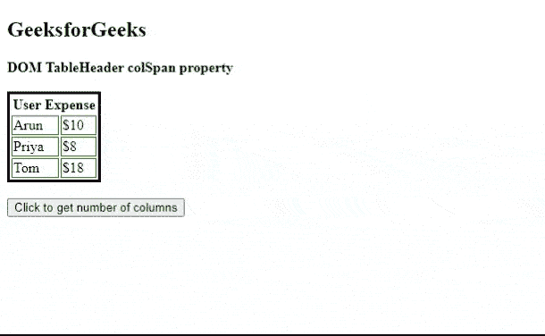
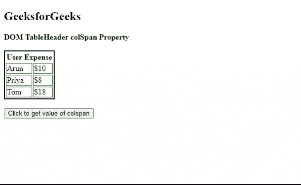

# HTML DOM TableHeader colSpan 属性

> 原文:[https://www . geesforgeks . org/html-DOM-table header-col span-property/](https://www.geeksforgeeks.org/html-dom-tableheader-colspan-property/)

[**HTML DOM TableHeader**](https://www.geeksforgeeks.org/html-dom-tableheader-object/)*colSpan***属性用于**设置**或**返回**colSpan 属性的值。*colspan*属性定义了标题单元格应该跨越的列数。**

****语法:****

*   **它返回 *colSpan* 属性。**

```html
**tableheaderObject.colSpan**
```

*   **用于设置 *colSpan* 属性。**

```html
**tableheaderObject.colSpan = number**
```

****属性值**:包含单个值，即**数值**，代表标题单元格应该跨越的列数。**

****返回值**:返回一个代表列数的数值。**

****示例 1:** 本示例返回一个 *colSpan* 属性。**

## **超文本标记语言**

```html
<!DOCTYPE html>
<html>

<head>
    <!-- style to set border -->
    <style>
        table{
            border:3px solid black;
        }        
        td{
          border: 1px solid green;
          }        
    </style>
</head>

<body>
    <h2>GeeksforGeeks</h2>
    <b>DOM TableHeader colSpan property</b>
    <br/><br/>
    <table>
            <tr> 
                <th id="tableHeaderID" colspan="2">
                    User Expense
                </th> 
            </tr> 

            <tr> 
                <td>Arun</td> 
                <td>$10</td> 
            </tr>              
            <tr> 
                <td>Priya</td> 
                <td>$8</td> 
            </tr>
            <tr> 
                <td>Tom</td> 
                <td>$18</td> 
            </tr>

    </table>
    <br>
    <button onclick="myGeeks()">
        Click to get number of columns
    </button>
    <p id="paraID"
       style="font-size:25px;
            color:green">
    </p>

    <!-- script to access th element -->
    <script>
        function myGeeks() {
            var tab = document.getElementById(
            "tableHeaderID").colSpan;
            document.getElementById(
            "paraID").innerHTML = tab;
        }
    </script>
</body>

</html>                    
```

****输出:****

**

colSpan 属性** 

****示例 2:** 下面的代码用于设置 *colSpan* 属性。**

## **超文本标记语言**

```html
<!DOCTYPE html>
<html>

<head>
    <!-- style to set border -->
    <style>
        table
        {
         border: 2px solid black;
        }         

        td {
            border: 1px solid green;
        }
    </style>
</head>

<body>

    <h2>GeeksforGeeks</h2>

    <b>DOM TableHeader colSpan Property</b>
    <br/><br/>

    <table>
            <tr> 
                <th id="tableHeaderID" colspan="2">
                    User Expense
                </th> 
            </tr> 

            <tr> 
                <td>Arun</td> 
                <td>$10</td> 
            </tr>              
            <tr> 
                <td>Priya</td> 
                <td>$8</td> 
            </tr>
            <tr> 
                <td>Tom</td> 
                <td>$18</td> 
            </tr>

    </table>
    <br>
    <button onclick="myGeeks()">
        Click to get value of colspan
    </button>
    <p id="paraID"
       style="font-size:20px;
              color:green">
    </p>

    <!-- script to access th element -->
    <script>
        function myGeeks() {
            var tab = document.getElementById(
            "tableHeaderID").colSpan="4";
            document.getElementById(
            "paraID").innerHTML = 
            "The value of the colspan attribute was changed to:  " 
              + tab;
        }
    </script>
</body>

</html>
```

****输出:****

**

colSpan 属性** 

****支持的浏览器:****

*   **谷歌浏览器**
*   **边缘**
*   **Mozilla Firefox**
*   **歌剧**
*   **旅行队**