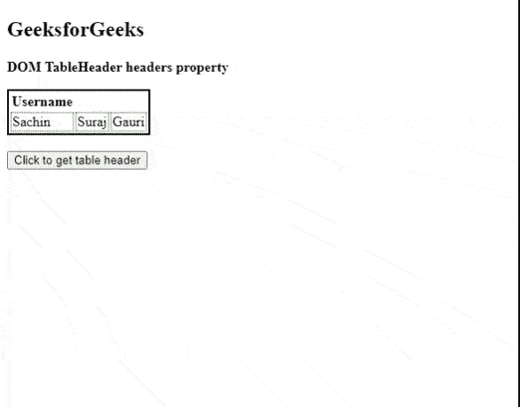
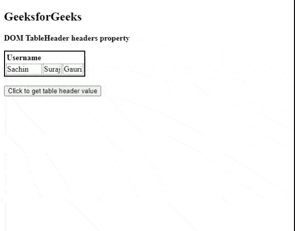

# HTML DOM 表格标题属性

> 原文:[https://www . geesforgeks . org/html-DOM-table header-headers-property/](https://www.geeksforgeeks.org/html-dom-tableheader-headers-property/)

[**HTML DOM TableHeader**](https://www.geeksforgeeks.org/html-tables/)**headers**属性用于**设置**或**返回**headers 属性的值。**表头的**属性用于指定包含当前表头单元格表头信息的表格单元格。

**语法**

*   它返回标头的属性。

    ```html
    tableheaderObject.headers
    ```

*   它用于设置标头的属性。

    ```html
    tableheaderObject.headers = header_ids
    ```

**属性值:**它包含值，即**标题 _ id**，指定一个或多个标题单元格的单独 id 列表。

**返回值:**它返回一个字符串值，代表标题列表标识的分离列表。

**示例 1** :本示例返回标题的属性。

## 超文本标记语言

```html
<!DOCTYPE html>
<html>

<head>
    <!-- style to set border -->
    <style>
        table
        {
         border: 2px solid black;
        }        

        td 
        {
            border: 1px dotted green;
        }
    </style>
</head>

<body>

    <h2>GeeksforGeeks</h2>
    <b>DOM TableHeader headers property</b>
    <table> 
        <tr>
            <th id="tableHeaderID" headers="username">
                Username
            </th>
        </tr>

        <tr>
            <td>Sachin</td>
            <td>Suraj</td>
            <td>Gauri</td>
        </tr>

    </table>
    <br>
    <button onclick="getHeader()">
        Click to get table header
    </button>
    <p id="paraID" style="font-size:20px;color:green">
    </p>

    <!-- Script to access th element -->
    <script>
        function getHeader() {
            var tab = document.getElementById("tableHeaderID").headers;
            document.getElementById("paraID").innerHTML = tab;
        }
    </script>
</body>

</html>
```

**输出:**



**示例 2:** 下面的代码演示了标题属性的设置。

## 超文本标记语言

```html
<!DOCTYPE html>
<html>

<head>
    <!-- style to set border -->
    <style>
        table
        {
         border: 2px solid black;
        }        

        td 
        {
            border: 1px dotted green;
        }
    </style>
</head>

<body>

    <h2>GeeksforGeeks</h2>

    <b>DOM TableHeader headers property</b>

    <table> 
        <tr>
            <th id="tableHeaderID" headers="username">
                Username
            </th>
        </tr>

        <tr>
            <td>Sachin</td>
            <td>Suraj</td>
            <td>Gauri</td>
        </tr>

    </table>
    <br>
    <button onclick="getHeader()">
        Click to get table header value
    </button>
    <p id="paraID" style="font-size:18px;color:green">
    </p>

    <!-- Script to access th element -->
    <script>
        function getHeader() {
                var tab = document.getElementById(
            "tableHeaderID").headers = "user_firstname";
            document.getElementById("paraID").innerHTML = 
            "The value of the headers attribute was changed to: " + tab;
        }
    </script>
</body>

</html>
```

**输出:**



**支持的浏览器:**

*   谷歌 Chrome
*   火狐浏览器
*   歌剧
*   旅行队
*   互联网浏览器/边缘