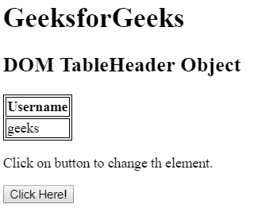
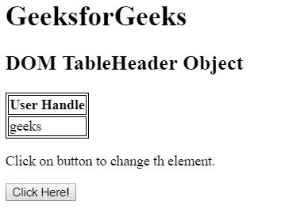
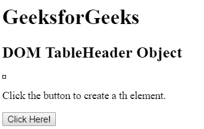
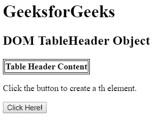

# HTML | DOM TableHeader 对象

> 原文:[https://www.geeksforgeeks.org/html-dom-tableheader-object/](https://www.geeksforgeeks.org/html-dom-tableheader-object/)

HTML DOM 中的 TableHeader 对象用来表示 HTML thElements. Use getElementById () method to access.Elements.

**语法:**

*   用于访问元素。

```html
document.getElementById("id");
```

*   用于创建元素。

```html
document.createElement("th");
```

**TableData 对象属性:**

<figure class="table">

| attribute | describe |
| abbreviate | This property is used to set or return the value of the abbreviated property. |
| align | This property is used to set or return the horizontal alignment of contents in data cells. |
|  | This property is used to set or return the vertical alignment of the contents in the cell. |
| width | This property is used to set or return the width of a data cell. |
| axis | This property is used to set or return a comma-separated list of related data cells. |
| background | This property is used to set or return the background image of a data cell. |
| bgcolor(bgcolor) | This property is used to set or return the background color of the table. |
| 细胞指数 | This property is used to return the position of a cell in the cell collection of a table row. |
| 荣誉勋爵 | This property is used to set or return the alignment characters of data cells. |
| 乔夫 | This property is used to set or return the horizontal offset of the ch property. |
| colSpan | This property is used to set or return the value of colSpan property. |
| meter | This property is used to set or return the value of the header property. |
| height | This property is used to set or return the height of the data cell. |
| noWrap | This property is used to set or return whether cell contents can wrap. |
| 行跨度 | This property is used to set or return the value of the row span property. |

</figure>

**示例 1:** 本示例使用 getElementById()方法访问<第>个元素。

## 超文本标记语言

```html
<!DOCTYPE html>
<html>

<head>

    <!-- style to set border -->
    <style>
        table, th, td {
            border: 1px solid black;
        }
    </style>
</head>

<body>

    <h1>GeeksforGeeks</h1>

    <h2>DOM TableHeader Object</h2>

    <table>
        <tr>
            <th id = "table">Username</th>
        </tr>

        <tr>
            <td>geeks</td>
        </tr>
    </table>

<p>
        Click on button to change th element.
    </p>

    <button onclick = "myGeeks()">
        Click Here!
    </button>

    <!-- Script to access th element -->
    <script>
        function myGeeks() {
            var tab = document.getElementById("table");
            tab.innerHTML = "User Handle";
        }
    </script>
</body>

</html>                   
```

**输出:**
**之前点击按钮:**



**点击按钮后:**



**示例 2:** 本示例使用 document.createElement()方法创建第<个>元素。

## 超文本标记语言

```html
<!DOCTYPE html>
<html>

<head>

    <!-- style to set border -->
    <style>
        table, th, td {
            border: 1px solid black;
        }
    </style>
</head>

<body>

    <h1>GeeksforGeeks</h1>

    <h2>DOM TableHeader Object</h2>

    <table id = "tab">
        <tr id = "mytable">
        </tr>
    </table>

<p>Click the button to create a th element.</p>

    <button onclick = "myGeeks()">
        Click Here!
    </button>

    <!-- script to create th element -->
    <script>
        function myGeeks() {

            /* Create an input element */
            var tab_row = document.createElement("TH");

            /* Set the the text node */
            var text = document.createTextNode("Table Header Content");
            tab_row.appendChild(text);
            document.getElementById("mytable").appendChild(tab_row);
        }
    </script>
</body>

</html>                   
```

**输出:**
**之前点击按钮:**



**点击按钮后:**



**支持的浏览器:**

*   谷歌 Chrome
*   边缘
*   Mozilla Firefox
*   歌剧
*   旅行队