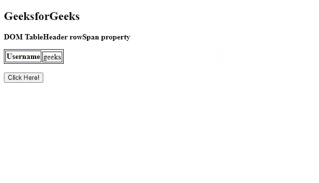
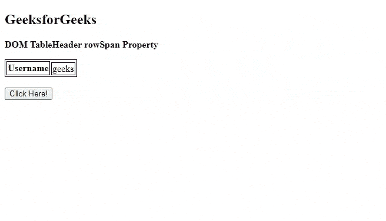

# HTML DOM TableHeader rowSpan 属性

> 原文:[https://www . geesforgeks . org/html-DOM-table header-row span-property/](https://www.geeksforgeeks.org/html-dom-tableheader-rowspan-property/)

[**HTML DOM TableHeader**](https://www.geeksforgeeks.org/html-dom-tableheader-object/)**row span 属性**用于**设置**或**返回 *rowspan* 属性的值。HTML 中的 *rowspan* 属性指定了单元格应该跨越的行数。**

**语法:**

*   它返回 rowspan 属性。

```html
tableheaderObject.rowSpan
```

*   它用于设置 rowSpan 属性。

```html
tableheaderObject.rowSpan = number
```

**属性值:**它包含值，即**数**，指定单元格应跨越的行数。

**返回值:**返回一个数值，代表单元格应该跨越的行数。

**示例 1:** 本示例返回一个 *rowspan* 属性。

## 超文本标记语言

```html
<!DOCTYPE html>
<html>

<head>
    <!-- style to set border -->
    <style>
        table,       
        th,
        td {
            border: 1px solid black;
        }
    </style>
</head>

<body>
    <h2>GeeksforGeeks</h2>

    <b>DOM TableHeader rowSpan property</b>
    <table>
        <tr>
            <th id="headerID" rowspan="3"
                abbr="GeeksforGeeks">
            Username
            </th>
        </tr>

        <tr>
            <td>geeks</td>
        </tr>
    </table>
    <br>
    <button onclick="myGeeks()">
        Click Here!
    </button>
    <p id="paraID" style="font-size:25px;color:green">
    </p>

    <!-- Script to access th element -->
    <script>
        function myGeeks() {
            var tab = document.getElementById("headerID").rowSpan;
            document.getElementById("paraID").innerHTML = tab;
        }
    </script>
</body>

</html>
```

**输出:**



**示例 2:** 下面的代码用于设置 *rowSpan* 属性。

## 超文本标记语言

```html
<!DOCTYPE html>
<html>

<head>
    <!-- style to set border -->
    <style>
        table,       
        th,
        td {
            border: 1px solid black;
        }
    </style>
</head>

<body>

    <h2>GeeksforGeeks</h2>

    <b>DOM TableHeader rowSpan Property</b>
    <table>
        <tr>
            <th id="headerID" rowspan="3"
                abbr="GeeksforGeeks">
             Username
            </th>
        </tr>
        <tr>
            <td>geeks</td>
        </tr>
    </table>
    <br>
    <button onclick="myGeeks()">
        Click Here!
    </button>
    <p id="paraID" style="font-size:20px;color:green">
    </p>

    <!-- script to access th element -->
    <script>
        function myGeeks() {
            var tab =
            document.getElementById("headerID").rowSpan = "2";
            document.getElementById("paraID").innerHTML
            = "The value of the rowspan attribute was changed to : " + tab;
        }
    </script>
</body>

</html>
```

**输出**



**支持的浏览器:**

*   谷歌 Chrome
*   微软公司出品的 web 浏览器
*   歌剧
*   火狐浏览器
*   苹果 Safari