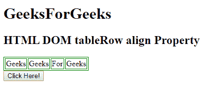

# HTML | DOM TableRow 对齐属性

> 原文:[https://www . geesforgeks . org/html-DOM-tablerow-align-property/](https://www.geeksforgeeks.org/html-dom-tablerow-align-property/)

**HTML DOM TableRow 对齐属性**用于设置或返回表格行内内容的水平对齐。HTML 5 不支持。

**语法:**

*   它返回 align 属性。

    ```html
    TableRowobject.align
    ```

*   它设置 align 属性。

    ```html
    TableRowObject.align = "left | right | center"
    ```

**属性值:**

*   **左:**设置左对齐到 TableRow。
*   **居中:**将居中对齐设置为 TableRow。这是默认值。
*   **右:**设置右对齐 TableRow。
*   **对齐:**拉伸段落文本，使所有行的宽度相等。
*   **字符:**它将文本对齐设置为特定字符。

**返回值:**返回一个字符串值，代表 TableRow 元素的对齐方式。

**示例 1:** 本示例设置 TableRow 对齐属性。

```html
<!DOCTYPE html> 
<html> 

<head> 
    <style> 
        table, th, td { 
            border: 1px solid green; 
        } 
    </style> 
</head> 

<body> 

    <h1> 
        GeeksForGeeks 
    </h1> 

    <h2>HTML DOM tableRow align Property</h2> 

    <table> 
        <tr id = "GFG" align = "left"> 
            <td>Geeks</td> 
            <td>Geeks</td> 
            <td>For</td> 
            <td>Geeks</td> 
        </tr> 
    </table> 

    <button onclick = "myGeeks()"> 
        Click Here! 
    </button> 
    <p id ="sudo"></p>

    <script> 
        function myGeeks() { 
            var row = document.getElementById("GFG").align; 
            document.getElementById("sudo").innerHTML = row; 
        } 
    </script> 
</body> 

</html>                     
```

**输出:**

*   **点击按钮前:**
    
*   **点击按钮后:**
    

**例 2:**

```html
<!DOCTYPE html> 
<html> 

<head> 
    <style> 
        table, th, td { 
            border: 1px solid green; 
        } 
    </style> 
</head> 

<body> 
    <h1> 
        GeeksForGeeks 
    </h1> 

    <h2>HTML DOM tableRow align Property</h2> 

    <table> 
        <tr id = "GFG" align = "left"> 
            <td>Geeks</td> 
            <td>Geeks</td> 
            <td>For</td> 
            <td>Geeks</td> 
        </tr> 
    </table> 

    <button onclick = "myGeeks()"> 
        Click Here! 
    </button> 
    <p id ="sudo"></p>

    <script> 
        function myGeeks() { 
            var row = document.getElementById("GFG").align = "right"; 
            document.getElementById("sudo").innerHTML = 
                        "The value was changed to  " + row;
        } 
    </script> 
</body> 

</html>
```

**输出:**

*   **点击按钮前:**
    
*   **点击按钮后:**
    

**支持的浏览器:****DOM TableRow align Property**支持的浏览器如下:

*   谷歌 Chrome
*   微软公司出品的 web 浏览器
*   火狐浏览器
*   苹果 Safari
*   歌剧