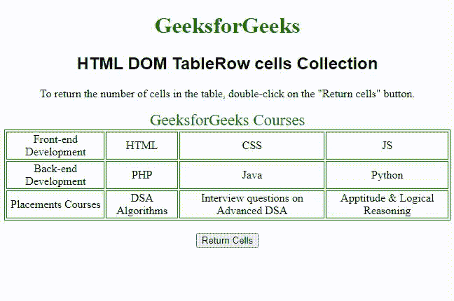

# HTML DOM TableRow 单元格集合

> 原文:[https://www . geesforgeks . org/html-DOM-tablerow-cells-collection/](https://www.geeksforgeeks.org/html-dom-tablerow-cells-collection/)

**HTML DOM TableRow 单元格集合**用于返回表格中特定行的所有单元格总数。它包括所有的< td >和< th >元素。< tr >元素的顺序与它们在源代码中的位置排序方式相同。

**语法:**

```html
tableObject.cells
```

**属性:**

*   **长度:**用于返回集合中< td >和< th >元素的个数。

**方法:**

*   **【索引】:**用于从集合中返回带有指定索引的< td >和< th >元素。如果索引号超出范围，它将返回 null。
*   **项(索引):**也用于从集合中返回带有指定索引的< td >和< th >元素。如果索引号超出范围，它将返回 null。
*   **name item(id)**:也用于从集合中返回指定 id 的< td >和< th >元素。如果 id 不存在，则返回值为 null。

**返回值** :-用于返回表中某一行的所有< td >和< th >元素。

下面的示例说明了 TableRow 单元格集合的实现。

**示例:**

## 超文本标记语言

```html
<!DOCTYPE html>
<html>
  <head>
    <title>TableRow cells Collection in HTML</title>
    <style>
      table,
      td {
        border: 1px solid green;
      }
      h1 {
        color: green;
      }
      h2 {
        font-family: sans-serif;
      }
      body {
        text-align: center;
      }
    </style>
  </head>

  <body>
    <h1>GeeksforGeeks</h1>
    <h2>HTML DOM TableRow cells Collection</h2>

<p>
      To return the number of cells in the table,
      double-click on the "Return cells" button.
    </p>

    <table id="Courses" align="center">
      <caption>
        GeeksforGeeks Courses
      </caption>
      <tr>
        <td>Front-end Development</td>
        <td>HTML</td>
        <td>CSS</td>
        <td>JS</td>
      </tr>
      <tr>
        <td>Back-end Development</td>
        <td>PHP</td>
        <td>Java</td>
        <td>Python</td>
      </tr>
      <tr>
        <td>Placements Courses</td>
        <td>DSA Algorithms</td>
        <td>Interview questions on Advanced DSA</td>
        <td>Aptitude & Logical Reasoning</td>
      </tr>
    </table>
    <br />

    <button onclick="rowCount()">Return Cells</button>

    <p id="test"></p>

    <script>
      function rowCount() {

        // Number of rows.
        var row = document.getElementById("Courses")
            .rows[2].cells.length;
        document.getElementById("test").innerHTML =
          " Number of cells in the 3rd row: " + row;
      }
    </script>
  </body>
</html>
```

**输出:**



**支持的浏览器:**

*   谷歌 Chrome 1.0 及以上版本
*   Internet Explorer 5.5 及以上版本
*   微软边缘 12.0 及以上版本
*   Firefox 1.0 及以上版本
*   Safari 3.0 及以上版本
*   Opera 12.1 及以上