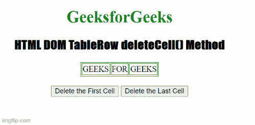

# HTML DOM TableRow deleteCell()方法

> 原文:[https://www . geesforgeks . org/html-DOM-tablerow-delete cell-method/](https://www.geeksforgeeks.org/html-dom-tablerow-deletecell-method/)

HTML DOM 中的 **TableRow deleteCell()方法**用于从表格的当前行中删除一个单元格。它是 TableRow 对象的预定义方法。

**语法:**

```html
***tablerowObject.deleteCell(index)***
```

**属性值:**

*   **索引:**它包含一个从 0 开始的数值，该数值定义了要从当前行删除的单元格的位置。例如-值 0th 表示要删除的第一个定位单元格。值-1 表示删除最后定位单元格。

**注:**

*   该参数将在火狐和 Opera 浏览器中强制定义。另一方面，它在 safari、chrome 和 IE 浏览器中是可选的。
*   如果此参数不包含任何值，它将删除 IE 中的最后一个单元格和 Chrome 和 Safari 中的第一个单元格。

**示例:**在本例中，我们将从当前行中删除第一个和单元格。

## 超文本标记语言

```html
<!DOCTYPE html>
<html>

<head>
    <title>
        HTML DOM TableRow deleteCell() Method
    </title>

    <style>
        table,
        td {
            border: 1px solid green;
        }

        h1 {
            color: green;
        }

        h2 {
            font-family: Impact;
        }

        body {
            text-align: center;
        }
    </style>
</head>

<body>
    <h1>GeeksforGeeks</h1>

    <h2>
        HTML DOM TableRow deleteCell() Method
    </h2>

    <table align="center">
        <tr id="gfg">
            <td>GEEKS</td>
            <td>FOR</td>
            <td>GEEKS</td>
        </tr>
    </table>
    <br>
    <button onclick="firstCell()">
        Delete the First Cell
    </button>
    <button onclick="lastCell()">
        Delete the Last Cell
    </button>
    <script>
        function firstCell() {
            var Cell =
                document.getElementById("gfg");
            Cell.deleteCell(0);
        }
        function lastCell() {
            var MyCell = document.getElementById("gfg");
            MyCell.deleteCell(-1);
        }
    </script>
</body>

</html>
```

**输出:**

