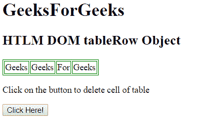
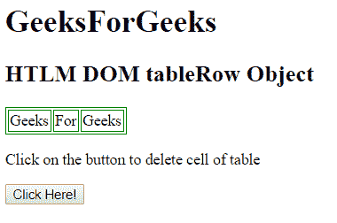
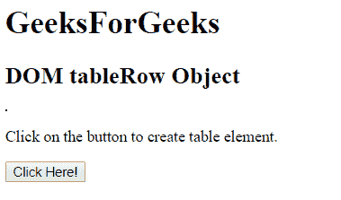
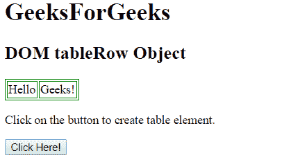

# HTML | DOM 棋盘物件

> 原文:[https://www.geeksforgeeks.org/html-dom-tablerow-object/](https://www.geeksforgeeks.org/html-dom-tablerow-object/)

HTML DOM 中的 TableRow 对象用来表示 HTML tr 元素。使用 getElementById()方法可以访问元素。

**语法:**

```html
document.getElementById("id");
```

tr 元素可以通过使用 document.createElement()方法来创建。

**语法:**

```html
document.createElement("tr");
```

**属性值:**

*   **对齐:**用于设置或返回表格行内内容的水平对齐。HTML 5 不支持。
*   **vAlign:** 用于设置或返回表格行内内容的垂直对齐方式。HTML 5 不支持。
*   **bgColor:** 用于设置或返回表格行的背景色。HTML 5 不支持。
*   **ch:** 用于设置或返回表格行中单元格的对齐字符。HTML 5 不支持。
*   **chOff:** 用于设置或返回 ch 属性的水平偏移量。HTML 5 不支持。
*   **高度:**用于设置或返回表格行的高度。HTML 5 不支持。
*   **rowIndex:** 用于返回一个表的 row 集合中的行的位置。
*   **sectionRowIndex:** 用于返回一行在 tbody、thead 或 tfoot 的 rows 集合中的位置。

**表格行对象方法:**

*   **deleteCell():** 此方法用于从当前表格行中删除一个单元格。
*   **insertCell():** 此方法用于将单元格插入当前表格行。

**示例 1:** 本示例描述了访问< tr >元素的 getElementById()方法。

## 超文本标记语言

```html
<!DOCTYPE html>
<html>

<head>
    <style>
        table, th, td {
            border: 1px solid green;

        }
    </style>
</head>

<body>

    <h1>
        GeeksForGeeks
    </h1>

    <h2>HTML DOM tableRow Object</h2>

    <table>
        <tr id = "GFG">
            <td>Geeks</td>
            <td>Geeks</td>
            <td>For</td>
            <td>Geeks</td>
        </tr>
    </table>

<p>
        Click on the button to delete
        cell of table
    </p>

    <button onclick = "myGeeks()">
        Click Here!
    </button>

    <script>
        function myGeeks() {
            var row = document.getElementById("GFG");
            row.deleteCell(0);
        }
    </script>
</body>

</html>                   
```

**输出:**
**之前点击按钮:**



**点击按钮后:**



**示例 2:** 本示例描述了 document.createElement()方法来创建< tr >元素。

## 超文本标记语言

```html
<!DOCTYPE html>
<html>

<head>
    <title>
        HTML DOM TableRow Object
    </title>

    <style>
        table, td {
            border: 1px solid green;
        }
    </style>
</head>

<body>

    <h1>GeeksForGeeks</h1>

    <h2>DOM tableRow Object</h2>

    <table id = "GeeksTable"></table>

<p>
        Click on the button to create
        table element.
    </p>

    <button onclick = "myGeeks()">
        Click Here!
    </button>

    <!-- script to create table -->
    <script>
        function myGeeks() {

            /* Create tr element */
            var x = document.createElement("TR");

            /* Set the id attribute */
            x.setAttribute("id", "GeeksTr");

            /* Append element to table */
            document.getElementById("GeeksTable").appendChild(x);

            /* Create td element */
            var y = document.createElement("TD");

            var t = document.createTextNode("Hello");

            y.appendChild(t);

            document.getElementById("GeeksTr").appendChild(y);

            /* Create td element */
            var z = document.createElement("TD");

            /* Assign node value */
            var p = document.createTextNode("Geeks!");

            /* Append node value to child element */
            z.appendChild(p);

            document.getElementById("GeeksTr").appendChild(z);
        }
    </script>
</body>

</html>                   
```

**输出:**
**之前点击按钮:**



**点击按钮后:**



**支持的浏览器:**

*   谷歌 Chrome
*   微软公司出品的 web 浏览器
*   Mozilla Firefox
*   歌剧
*   旅行队