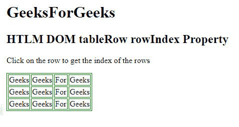
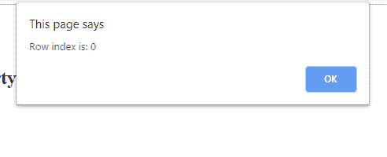

# html | DOM tablerow index property

> 原文:[https://www . geesforgeks . org/html-DOM-tablerow-row index-property/](https://www.geeksforgeeks.org/html-dom-tablerow-rowindex-property/)

HTML DOM 中的 **TableRow rowIndex 属性**用于返回行集合中的行的位置和索引。

**语法:**返回 rowIndex 属性。

```html
tablerowObject.rowIndex
```

**返回值:**返回代表一个表的行集合中的一行位置的数值。

**示例:**

```html
<!DOCTYPE html> 
<html> 

<head> 
    <title>
        HTML DOM tableRow rowIndex Property
    </title>

    <style> 
        table, th, td { 
            border: 1px solid green; 
        } 
    </style> 
</head> 

<body> 
    <h1> 
        GeeksForGeeks 
    </h1> 

    <h2>HTML DOM tableRow rowIndex Property</h2> 

    <p> 
        Click on the row to get the
        index of the rows
    </p>

    <table> 
        <tr id = "GFG" onclick="myGeeks(this)"> 
            <td>Geeks</td> 
            <td>Geeks</td> 
            <td>For</td> 
            <td>Geeks</td> 
        </tr> 
        <tr id = "GFG" onclick="myGeeks(this)"> 
            <td>Geeks</td> 
            <td>Geeks</td> 
            <td>For</td> 
            <td>Geeks</td> 
        </tr> 
        <tr id = "GFG" onclick="myGeeks(this)"> 
            <td>Geeks</td> 
            <td>Geeks</td> 
            <td>For</td> 
            <td>Geeks</td> 
        </tr> 
    </table> 

    <p id = "sudo"></p>

    <script> 
        function myGeeks(x) {
            alert("Row index is: " + x.rowIndex);
        }
    </script>
</body> 

</html>
```

**输出:**

*   **点击行元素前:**
    
*   **点击行元素后:**
    

**支持的浏览器:**下面列出了 **HTML DOM tableRow rowIndex 属性**支持的浏览器:

*   谷歌 Chrome
*   微软公司出品的 web 浏览器
*   火狐浏览器
*   旅行队
*   歌剧