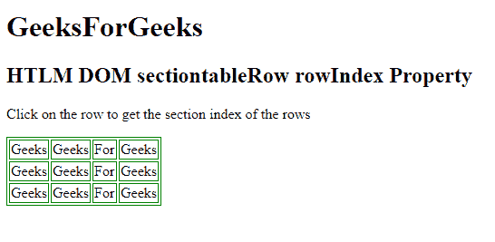
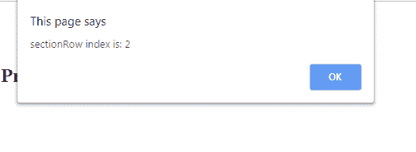

# HTML DOM TableRow section row index 属性

> 原文:[https://www . geesforgeks . org/html-DOM-tablerow-sectionrownindex-property/](https://www.geeksforgeeks.org/html-dom-tablerow-sectionrowindex-property/)

HTML DOM 中的 **TableRow sectionRowIndex 属性**用于返回一个<元素、>元素、<元素、>元素或<元素的 Row 集合中的一行的位置。

**语法:**返回 sectionRowIndex 属性。

```html
tablerowObject.sectionRowIndex 
```

**返回值:**它返回一个数值，该数值代表一个<><t body>或< tfoot >元素的行集合中该行的位置。

**示例:**

```html
<!DOCTYPE html> 
<html> 

<head> 
    <title>
        HTML DOM sectiontableRow rowIndex Property
    </title>

    <style> 
        table, th, td { 
            border: 1px solid green; 
        } 
    </style> 
</head> 

<body> 

    <h1> 
        GeeksForGeeks 
    </h1> 

    <h2>HTML DOM sectiontableRow rowIndex Property</h2> 

    <p> 
        Click on the row to get the
        section index of the rows
    </p>

    <table> 
        <tr id = "GFG" onclick="myGeeks(this)"> 
            <td>Geeks</td> 
            <td>Geeks</td> 
            <td>For</td> 
            <td>Geeks</td> 
        </tr> 
        <tr id = "GFG" onclick="myGeeks(this)"> 
            <td>Geeks</td> 
            <td>Geeks</td> 
            <td>For</td> 
            <td>Geeks</td> 
        </tr> 
        <tr id = "GFG" onclick="myGeeks(this)"> 
            <td>Geeks</td> 
            <td>Geeks</td> 
            <td>For</td> 
            <td>Geeks</td> 
        </tr> 
    </table> 

    <p id = "sudo"></p>

    <script> 
        function myGeeks(x) {
            alert("sectionRow index is: "
                    + x.sectionRowIndex);
        }
    </script> 
</body> 

</html>           
```

**输出:**

*   **按钮打卡前:**
    
*   **点击按钮后:**
    

**支持的浏览器:**下面列出了**HTML DOM TableRow section row index 属性**支持的浏览器:

*   谷歌 Chrome
*   微软公司出品的 web 浏览器
*   火狐浏览器
*   旅行队
*   歌剧