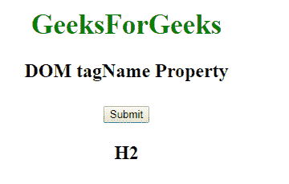

# HTML DOM 标记名属性

> 原文:[https://www.geeksforgeeks.org/html-dom-tagname-property/](https://www.geeksforgeeks.org/html-dom-tagname-property/)

**DOM 标记名**属性用于返回元素的标记名。它是只读属性，用于以大写字母显示标记名的返回值。

**语法:**

```html
element.tagName 
```

**返回值:**它返回一个字符串值，用大写字母表示元素的标记名。

**示例:**

```html
<!DOCTYPE html>
<html>

<head>
    <style>
        h1 {
            color: green;
            font-size: 35px;
        }
    </style>
</head>

<body>
    <center>
        <h1>GeeksForGeeks</h1>
        <h2 id="GFG">DOM tagName Property</p>

<button onclick="Geeks()">Submit</button>

<p id="sudo"></p>

<script>
function Geeks() {
  var w = document.getElementById("GFG").tagName;
  document.getElementById("sudo").innerHTML = w;
}
</script>

</body>
</html>
```

**输出:**
**点击按钮前:**


**点击按钮后:**


**支持的浏览器:**DOM 标记名属性支持的浏览器如下:

*   谷歌 Chrome
*   微软公司出品的 web 浏览器
*   火狐浏览器
*   歌剧
*   旅行队