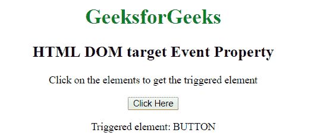

# HTML | DOM 目标事件属性

> 原文:[https://www . geesforgeks . org/html-DOM-target-event-property/](https://www.geeksforgeeks.org/html-dom-target-event-property/)

HTML DOM 中的**目标事件属性**用于返回触发事件的元素。

**语法:**

```html
event.target
```

**返回值:**该属性返回事件最初发生的对象的引用。

以下示例说明了 HTML DOM 中的目标事件属性:

**示例:**

```html
<!DOCTYPE html>
<html>

<head>
    <title>
        HTML DOM target Event Property
    </title>

    <style>
        body {
            text-align:center;
        }
        h1 {
            color:green;
        }
    </style>
</head>

<body onclick="myGeeks(event)">

    <h1>GeeksforGeeks</h1>

    <h2>HTML DOM target Event Property</h2>

    <p>Click on the elements to get the triggered element</p>

    <button>Click Here</button>

    <p id = "GFG"></p>

    <script>
        function myGeeks(event) { 
            var x = event.target;

            document.getElementById("GFG").innerHTML
                = "Triggered element: " + x.tagName;
        }
    </script>
</body>

</html>
```

**输出:**


**支持的浏览器:**HTML DOM 目标事件属性支持的浏览器如下:

*   谷歌 Chrome
*   Internet Explorer 9.0
*   火狐浏览器
*   旅行队
*   歌剧