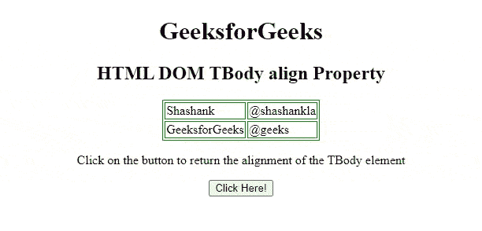
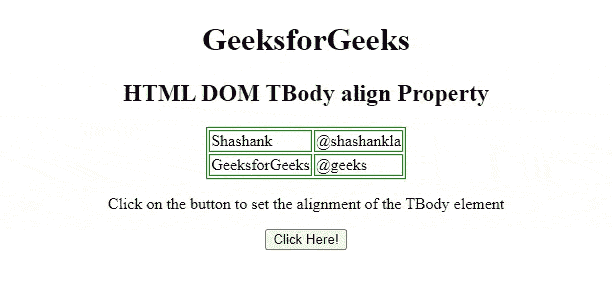

# HTML DOM tbbody 对齐属性

> 原文:[https://www . geesforgeks . org/html-DOM-t body-align-property/](https://www.geeksforgeeks.org/html-dom-tbody-align-property/)

**HTML**[**DOM**](https://www.geeksforgeeks.org/dom-document-object-model/)**Tbody*****align*****属性用于设置或返回 [< tbody >](https://www.geeksforgeeks.org/html-tbody-tag/) 元素内内容的水平对齐。HTML5 不支持它。**

****语法:****

*   **它返回 align 属性。**

    ```html
    tbodyobject.align
    ```

*   **它设置 align 属性。**

    ```html
    tbodyObject.align = "left | right | center"
    ```

****属性值:****

*   ****左:**将文本设置为左对齐。**
*   ****右:**设置文本右对齐。**
*   ****居中:**设置文本居中对齐。**
*   ****对齐:**拉伸段落文本，使所有行的宽度相等。**
*   ****字符:**它将文本对齐设置为特定字符。**

****返回值:**它返回一个字符串值，表示**

**element.

**示例:**下面的 HTML 代码说明了如何返回 tbbody*align*属性。

## 超文本标记语言

```html
<!DOCTYPE html>
<html>

<head>
    <style>
        table,
        th,
        td {
            border: 1px solid green;
        }
    </style>
</head>

<body>
    <center>
        <h1>
            GeeksforGeeks
        </h1>

        <h2>HTML DOM TBody align Property </h2>

        <!-- tbody tag starts -->
        <table>
            <tbody id="tbodyID" align="left">
                <tr>
                    <td>Shashank</td>
                    <td>@shashankla</td>
                </tr>
                <tr>
                    <td>GeeksforGeeks</td>
                    <td>@geeks</td>
                </tr>
            </tbody>
            <!-- tbody tag ends -->
        </table>

        <p>
            Click on the button to return
            the alignment of the TBody element
        </p>

        <button onclick="btnclick()">
            Click Here!
        </button>

        <p id="paraID"></p>
    </center>

    <script>
        function btnclick() {
            var tbody = document
                .getElementById("tbodyID").align;

            document.getElementById("paraID")
                .innerHTML = tbody;
        }
    </script>
</body>

</html>
```

**输出:**



**示例 2:** 下面的 HTML 代码说明了如何设置 tbbody*align*属性。

## 超文本标记语言

```html
<!DOCTYPE html>
<html>

<head>
    <style>
        table,
        th,
        td {
            border: 1px solid green;
        }
    </style>
</head>

<body>
    <center>
        <h1>
            GeeksforGeeks
        </h1>

        <h2>HTML DOM TBody align Property </h2>

        <!-- tbody tag starts -->
        <table>
            <tbody id="tbodyID" align="left">
                <tr>
                    <td>Shashank</td>
                    <td>@shashankla</td>
                </tr>
                <tr>
                    <td>GeeksforGeeks</td>
                    <td>@geeks</td>
                </tr>
            </tbody>
            <!-- tbody tag ends -->
        </table>

        <p>
            Click on the button to set the
            alignment of the TBody element
        </p>

        <button onclick="btnclick()">
            Click Here!
        </button>

        <p id="paraID"></p>
    </center>

    <script>
        function btnclick() {
            var tbody = document.getElementById("tbodyID")
                .align = "right";
            document.getElementById("paraID")
                .innerHTML = tbody;
        }
    </script>
</body>

</html>
```

**输出:**



**支持的浏览器:**

*   谷歌 Chrome
*   微软公司出品的 web 浏览器
*   火狐浏览器
*   旅行队
*   歌剧**