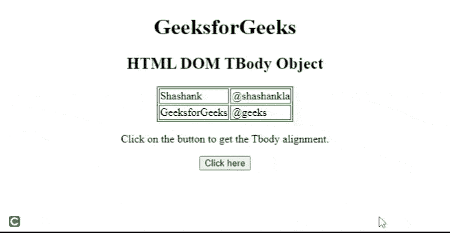
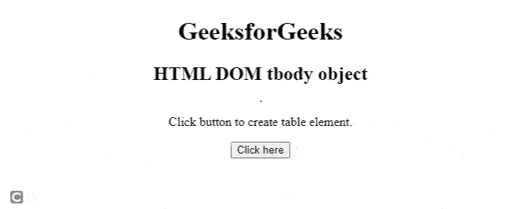

# HTML DOM tbbody 对象

> 原文:[https://www.geeksforgeeks.org/html-dom-tbody-object/](https://www.geeksforgeeks.org/html-dom-tbody-object/)

[HTML DOM](https://www.geeksforgeeks.org/dom-document-object-model/) 中的 **tbody** 对象用来表示 HTML[T8】t body>T5】元素。使用](https://www.geeksforgeeks.org/html-tbody-tag/) [getElementById()](https://www.geeksforgeeks.org/html-dom-getelementbyid-method/) 方法可以访问< tbody >元素。

**语法:**以下是访问< tbody >元素的语法。

```html
document.getElementById("id"); 
```

**属性值**

*   **对齐:**设置内容的对齐方式。
*   **标记:**设置内容的垂直对齐方式。
*   **字符:**将<标签和>标签内的内容对齐设置为一个字符。
*   **charoff: I** t 用于设置字符，<标签和>标签内的内容与 char 属性指定的字符对齐。

**示例:**下面的 HTML 代码演示了如何访问< tbody >元素。

## 超文本标记语言

```html
<!DOCTYPE html>
<html>

<head>
    <style>
        table,
        th,
        td {
            border: 1px solid green;
        }
    </style>
</head>

<body>
    <center>
        <h1>GeeksforGeeks</h1>

        <h2>HTML DOM TBody Object </h2>

        <table>
            <tbody id="tbodyID" align="left">
                <tr>
                    <td>Shashank</td>
                    <td>@shashankla</td>
                </tr>
                <tr>
                    <td>GeeksforGeeks</td>
                    <td>@geeks</td>
                </tr>
            </tbody>
        </table>

<p>
            Click on the button to get
            the Tbody alignment.
        </p>

        <button onclick="btnclick()">
            Click here
        </button>

        <p id="paraID"></p>

    </center>

    <script>
        function btnclick() {
            var tbody = document
                .getElementById("tbodyID").align;
            document.getElementById(
                "paraID").innerHTML = tbody;
        }
    </script>
</body>

</html>
```

**输出:**



**语法:**创建<物体>对象的语法

```html
document.createElement("tr");
```

**示例:**下面的 HTML 代码说明了如何创建一个< tbody >对象。

## 超文本标记语言

```html
<!DOCTYPE html>
<html>

<head>
    <style>
        table,
        th,
        td {
            border: 1px solid green;
        }
    </style>
</head>

<body>
    <center>
        <h1>GeeksforGeeks</h1>

        <h2>HTML DOM tbody object</h2>

        <table id="tableID">

        </table>

<p>
            Click button to create table element.
        </p>

        <button onclick="btnclick()">
            Click here
        </button>
    </center>

    <script>
        function btnclick() {

            /* Create tbody element */
            var x = document.createElement("TBODY");

            /* Create tr element */
            var y = document.createElement("TR");

            /* Create td element */
            var z = document.createElement("TD");
            z.innerHTML = "Manas Chhabra";

            /* Create td element */
            var w = document.createElement("TD");
            w.innerHTML = "@manas_coolguy";
            y.appendChild(z);
            y.appendChild(w);
            x.appendChild(y);
            document.getElementById("tableID").appendChild(x);
        }
    </script>
</body>

</html>
```

**输出:**

