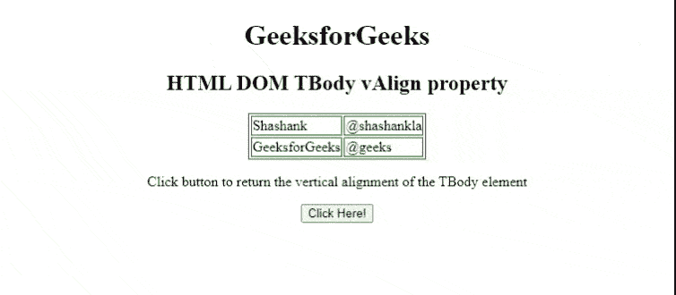

# HTML DOM 标签属性

> 原文:[https://www . geesforgeks . org/html-DOM-t body-valign-property/](https://www.geeksforgeeks.org/html-dom-tbody-valign-property/)

**HTML DOM tbbody vAlign**属性用于设置或返回[<tbbody>](https://www.geeksforgeeks.org/html-tbody-tag/)元素的 *valign* 属性的值。 *valign* 属性用于指定表体元素内文本内容的垂直对齐方式。

**语法:**

它返回 TBody *vAlign* 属性。

```html
TBodyobject.vAlign;
```

它设置了 TBody *vAlign* 属性。

```html
TBodyobject.vAlign = "top|middle|bottom|baseline";
```

**属性值:**

*   **顶部**:将内容设置为顶部对齐。
*   **中:**将内容设置为中对齐。
*   **底部:**它将内容设置为底部对齐。
*   **基线:**它将上下文设置为基线。基线是大多数角色所处的位置。

**返回值:**返回一个字符串值，代表< tbody >元素的垂直对齐方式。

**示例 1:** 下面的 HTML 代码说明了如何返回 tbbody*vAlign*属性。

## 超文本标记语言

```html
<!DOCTYPE html>
<html>

<head>
    <style>
        table, th, td {
            border: 1px solid green;
        }
    </style>
</head>

<body>
   <center>
        <h1>
            GeeksforGeeks
        </h1>

        <h2>HTML DOM TBody vAlign property </h2>
         <!-- tbody tag starts -->
        <table>
            <tbody id="tbodyID" valign="top">
                <tr>
                    <td>Shashank</td>
                    <td>@shashankla</td>
                </tr>
                    <tr>
                    <td>GeeksforGeeks</td>
                    <td>@geeks</td>
                </tr>
            </tbody>
            <!-- tbody tag ends  -->             
        </table>

         <p>
            Click button to return the vertical 
            alignment of the TBody element
        </p>

        <button onclick = "btnclick()">
            Click Here!
        </button> 
        <p id ="paraID"></p>

        <script>
            function btnclick() {
                var tbody = document.getElementById("tbodyID").vAlign;
                 document.getElementById("paraID").innerHTML = tbody;
            }
        </script>
</body>
</html>
```

**输出:**



**示例 2:** 下面的代码说明了如何设置**TBody***T5T7**vAlign**属性。*

## 超文本标记语言

```html
<!DOCTYPE html>
<html>

<head>
    <style>
        table,
        th,
        td {
            border: 1px solid green;
        }
    </style>
</head>

<body>
    <center>
        <h1>
            GeeksforGeeks
        </h1>

        <p><b>HTML DOM TBody vAlign property </b></p>

        <!-- tbody tag starts-->
        <table>
            <tbody id="tbodyID" valign="top">
                <tr>
                    <td>Shashank</td>
                    <td>@shashankla</td>
                </tr>
                <tr>
                    <td>GeeksforGeeks</td>
                    <td>@geeks</td>
                </tr>
            </tbody>
            <!-- tbody tag ends  -->
        </table>

        <p>
            Click on the button to set the
            vertical alignment of the 
            TBody element
        </p>

        <button onclick="btnclick()">
            Click Here!
        </button>

        <p id="paraID"></p>
    </center>

    <script>
        function btnclick() {
            var tbody = document.getElementById(
                "tbodyID").vAlign = "bottom";
            document.getElementById("paraID")
                .innerHTML = "The value of the "
                + "Attribute was changed to: " 
                + tbody;
        }
    </script>
</body>

</html>
```

**输出:**


**支持的浏览器:**

*   谷歌 Chrome
*   微软公司出品的 web 浏览器
*   火狐浏览器
*   歌剧
*   苹果 Safari