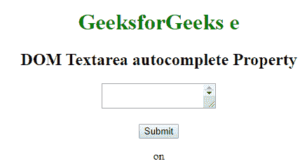

# HTML | DOM Textarea 自动完成属性

> 原文:[https://www . geesforgeks . org/html-DOM-textarea-autocomplete-property/](https://www.geeksforgeeks.org/html-dom-textarea-autocomplete-property/)

HTML DOM 中的 **textarea 自动完成属性**用于设置或返回 textarea 字段的自动完成属性的值。自动完成属性用于指定自动完成属性的值是“开”还是“关”。当“自动完成”属性设置为“开”时，浏览器将根据用户之前输入的值自动完成。

**语法:**

*   它返回 textarea 自动完成属性。

    ```html
    TextareaObject.autocomplete
    ```

*   它用于设置 textarea 自动完成属性。

    ```html
    TextareaObject.autocomplete = "on|off" 
    ```

**属性值:**包含以下两个值:

*   **开:**为默认值。它会自动完成这些值。
*   **off:** 定义用户应填写 URL 输入字段的值。它不会自动完成这些值。

**返回值:**返回一个代表自动完成状态的字符串值。

**示例 1:** 本示例说明如何返回 textarea 自动完成属性。

```html
<!DOCTYPE html> 
<html> 

<head> 
    <title>
        HTML DOM Textarea autocomplete Property 
    </title> 
</head> 

<body style="text-align:center"> 

    <h1 style="color: green;"> 
        GeeksforGeeks e
    </h1> 

    <h2>DOM Textarea autocomplete Property</h2> 

    <!-- Assigning id to textarea. -->
    <textarea id="myGeeks" autocomplete = "on"> 
        GeeksForGeeks. A computer 
        science portal for Geeks. 
    </textarea> 
    <br><br> 

    <button onclick="Geeks()">Submit</button> 

    <p id="sudo"></p> 

    <script> 
        function Geeks() { 

            // Return Boolean value to represent textarea. 
            var x = 
            document.getElementById("myGeeks").autocomplete; 

            document.getElementById("sudo").innerHTML = x; 
        } 
    </script> 
</body> 

</html>
```

**输出:**
**点击按钮前:**

**点击按钮后:**


**示例 2:** 本示例说明如何设置 textarea 自动完成属性。

```html
<!DOCTYPE html> 
<html> 

<head> 
    <title>
        HTML DOM Textarea autocomplete Property 
    </title> 
</head> 

<body style="text-align:center"> 

    <h1 style="color: green;"> 
        GeeksforGeeks e
    </h1> 

    <h2>DOM Textarea autocomplete Property</h2> 

    <!-- Assigning id to textarea. -->
    <textarea id="myGeeks" autocomplete = "on"> 
        GeeksForGeeks. A computer
        science portal for Geeks. 
    </textarea> 
    <br><br> 

    <button onclick="Geeks()">Submit</button> 

    <p id="sudo"></p> 

    <script> 
        function Geeks() { 

            // Return Boolean value to represent textarea. 
            var x = document.getElementById(
                    "myGeeks").autocomplete = "off"; 

            document.getElementById("sudo").innerHTML
                    = x; 
        } 
    </script> 
</body> 

</html>
```

**输出:**
**点击按钮前:**

**点击按钮后:**


**支持的浏览器:****HTML DOM textarea 自动完成属性**支持的浏览器如下:

*   谷歌 Chrome
*   微软公司出品的 web 浏览器
*   火狐浏览器
*   苹果 Safari
*   歌剧