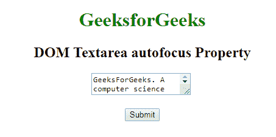
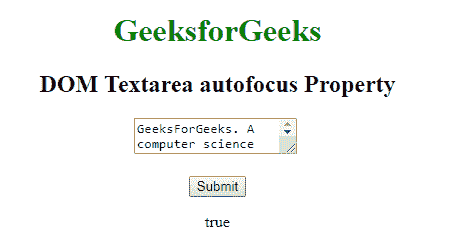
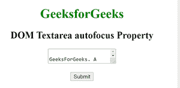
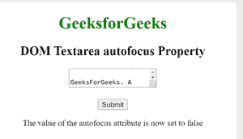

# HTML | DOM Textarea 自动对焦属性

> 原文:[https://www . geesforgeks . org/html-DOM-textarea-autofocus-property/](https://www.geeksforgeeks.org/html-dom-textarea-autofocus-property/)

**DOM Textarea 自动对焦属性**用于设置或返回页面加载时元素是否应该对焦。该属性用于反映*HTML*[T5】自动对焦](https://www.geeksforgeeks.org/?p=260413)T8】属性。
**语法:**

*   它用于返回自动对焦属性。

```html
textareaObject.autofocus
```

*   它用于设置自动对焦属性。

```html
textareaObject.autofocus = true|false
```

**房产价值:**

*   **true:** 它定义了一个获取焦点的文本区域。
*   **false:** 有默认值。它定义了 textarea 不能获得焦点。

**返回值:**返回一个**布尔**值，表示**文本区是否自动对焦**。
**例:**

## 超文本标记语言

```html
<!DOCTYPE html>
<html>

<head>
    <title>HTML DOM Textarea autofocus Property
    </title>
</head>

<body style="text-align:center">
    <h1 style="color: green;">
      GeeksforGeeks
    </h1>
    <h2>DOM Textarea autofocus Property</h2>

    <!-- Assigning id to textarea. -->
    <textarea id="myGeeks" autofocus>
        GeeksForGeeks. A computer science portal for Geeks.
    </textarea>
    <br>
    <br>

    <button onclick="Geeks()">Submit</button>
    <p id="sudo"></p>

    <script>
        function Geeks() {

            //  Return Boolean value to represent textarea.
            var x =
            document.getElementById("myGeeks").autofocus;
            document.getElementById("sudo").innerHTML = x;
        }
    </script>
</body>

</html>
```

**输出:**
**点击按钮前:**



**点击按钮后:**



**示例-2:**

## 超文本标记语言

```html
<!DOCTYPE html>
<html>
<body style="text-align:center">
    <h1 style="color: green;">
      GeeksforGeeks
    </h1>
    <h2>DOM Textarea autofocus Property</h2>

    <!-- Assigning id to textarea. -->
    <textarea id="myGeeks" autofocus>
        GeeksForGeeks. A computer science portal for Geeks.
    </textarea>
    <br>
    <br>

    <button onclick="Geeks()">Submit</button>
    <p id="sudo"></p>

    <script>
        function Geeks() {

            //  Return Boolean value to represent textarea.
            var x =
            document.getElementById("myGeeks").autofocus ="false";
            document.getElementById("sudo").innerHTML ="The value of the autofocus attribute is now set to " + x;
        }
    </script>
</body>

</html>
```

**输出:**

**点击按钮前:**



**点击按钮后:**



**支持的浏览器:**T2 DOM Textarea 自动对焦属性支持的浏览器如下:

*   谷歌 Chrome
*   微软公司出品的 web 浏览器
*   火狐浏览器
*   歌剧
*   旅行队