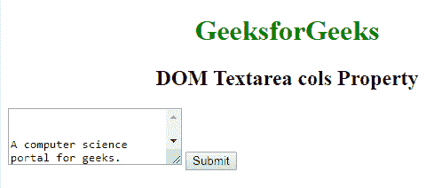
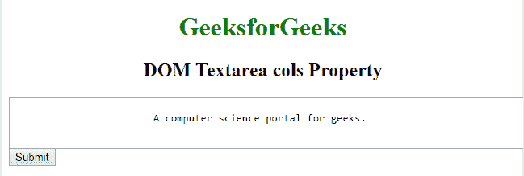
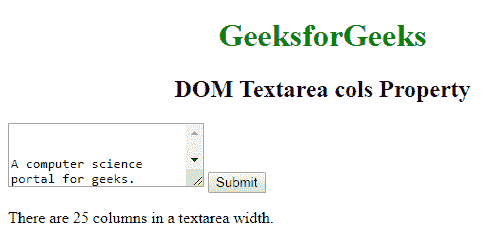

# HTML | DOM Textarea cols 属性

> 原文:[https://www . geesforgeks . org/html-DOM-textarea-cols-property/](https://www.geeksforgeeks.org/html-dom-textarea-cols-property/)

**DOM Textarea cols 属性**用于**设置**或**返回**Textarea 字段的 **cols 属性**的值。cols 属性表示一行中应该容纳多少*平均宽度字符*。

**语法:**

*   它用于返回 cols 属性。

    ```html
    textareaObject.cols
    ```

*   用于设置 cols 属性:

    ```html
    textareaObject.cols = number
    ```

**属性值:**

*   **数字:**指定文本区域字段的宽度。它有一个默认值，即 20。

**返回值:**返回一个数值，表示文本区域的字符宽度。

**示例-1:** HTML 程序来说明设置 **DOM Textarea cols 属性**。

```html
<!DOCTYPE html>
<html>

<head>
    <title>DOM Textarea cols Property</title>
    <style>
        h1,
        h2 {
            text-align: center;
        }
    </style>
</head>

<body>
    <h1 style="color: green;"> 
            GeeksforGeeks 
        </h1>

    <h2> 
            DOM Textarea cols Property 
        </h2>

    <!-- Below textarea is assigned a cols value 25 
            That is, 25 characters will fit in a line -->
    <textarea id="GFG" rows="4" cols="25">
        A computer science portal for geeks.
    </textarea>
    <button type="button" onclick="myGeeks()">Submit</button>

    <script>
        function myGeeks() {
            document.getElementById("GFG").cols = "100";
        }
    </script>
</body>

</html>
```

**输出:**

**点击按钮前:**


**点击按钮后:**


**示例-2:** HTML 程序来说明返回 **DOM Textarea cols Property** 。

```html
<!DOCTYPE html>
<html>

<head>
    <title>DOM Textarea cols Property</title>
    <style>
        h1,
        h2 {
            text-align: center;
        }
    </style>
</head>

<body>
    <h1 style="color: green;"> 
            GeeksforGeeks 
        </h1>

    <h2> 
            DOM Textarea cols Property 
        </h2>

    <!-- Below textarea is assigned a cols value 25 
            That is, 25 characters will fit in a line -->
    <textarea id="GFG" rows="4" cols="25">
        A computer science portal for geeks.
    </textarea>

    <button type="button" onclick="myGeeks()">Submit</button>
    <p id="sudo"></p>

    <script>
        function myGeeks() {
            var g = document.getElementById("GFG").cols;
            document.getElementById(
              "sudo").innerHTML = 
              "There are " + g +
              " columns in a textarea width.";
        }
    </script>
</body>

</html>
```

**输出**

**点击按钮前:**


**点击按钮后:**


**注:****【textareobject . cols】**和**【style . width】**工作原理相同。

**支持的浏览器:***文本区栏目属性*支持的浏览器如下:

*   谷歌 Chrome
*   微软公司出品的 web 浏览器
*   火狐浏览器
*   歌剧
*   旅行队