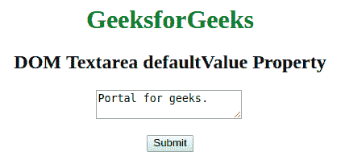

# HTML | DOM Textarea default value 属性

> 原文:[https://www . geesforgeks . org/html-DOM-textarea-default value-property/](https://www.geeksforgeeks.org/html-dom-textarea-defaultvalue-property/)

**DOM Textarea 默认值属性**用于**设置**或**返回***Textarea 字段的默认值*。

**语法:**

*   它用于返回 defaultValue 属性。

    ```html
    textareaObject.defaultValue
    ```

*   用于设置默认值属性:

    ```html
    textareaObject.defaultValue = text/value 
    ```

**属性值:**

*   **文本:**指定文本区域的默认值。

**返回值:**以字符串的形式返回文本区域的默认值。

**示例-1:** HTML 程序来说明设置 **DOM Textarea 默认值属性**。

```html
<!DOCTYPE html>
<html>

<head>
    <title>
      DOM Textarea defaultValue Property
  </title>
    <style>
        body {
            text-align: center;
        }

        h1,
        h2 {
            text-align: center;
        }
    </style>
</head>

<body>
    <h1 style="color: green;"> 
            GeeksforGeeks 
    </h1>

    <h2> 
        DOM Textarea defaultValue Property 
    </h2>

    <textarea id="GFG" 
              name="GFG_text">
        Portal for geeks.
    </textarea>

    <br>
    <br>
    <button type="button"
            onclick="myGeeks()">
      Submit
  </button>
    <p id="sudo"> </p>
    <script>
        function myGeeks() {
            document.getElementById("GFG").defaultValue =
                "A computer science portal for geeks";

        }
    </script>
</body>

</html>
```

**输出:**

**点击按钮前:**


**点击按钮后:**


**示例-2:** HTML 程序说明返回 **DOM Textarea 默认值属性**。

```html
<!DOCTYPE html>
<html>

<head>
    <title>
      DOM Textarea defaultValue Property
  </title>
    <style>
        body {
            text-align: center;
        }

        h1,
        h2 {
            text-align: center;
        }
    </style>
</head>

<body>
    <h1 style="color: green;"> 
            GeeksforGeeks 
    </h1>

    <h2> 
        DOM Textarea defaultValue Property 
    </h2>

    <textarea id="GFG"
              name="GFG_text">
        Portal for geeks.
    </textarea>

    <br>
    <br>
    <button type="button" 
            onclick="myGeeks()">
      Submit
  </button>
    <p id="sudo"> </p>
    <script>
        function myGeeks() {
            var x = 
                document.getElementById("GFG").defaultValue;

            document.getElementById("sudo").innerHTML =
                "Default value is " + x;

        }
    </script>
</body>

</html>
```

**输出**
**点击按钮前:**


**点击按钮后:**


**支持的浏览器:***文本区默认值属性*支持的浏览器如下:

*   谷歌 Chrome
*   微软公司出品的 web 浏览器
*   火狐浏览器
*   歌剧
*   旅行队