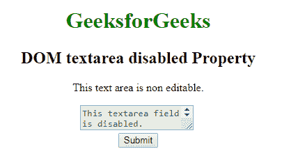
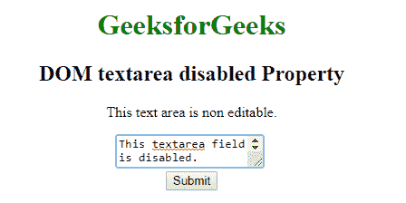
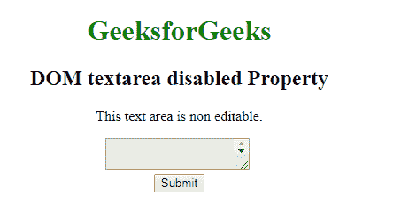
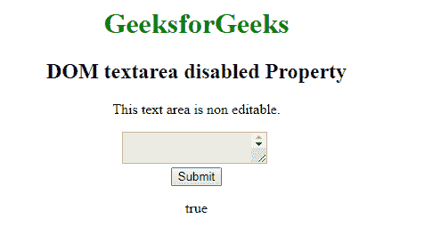

# HTML | DOM Textarea 禁用属性

> 原文:[https://www . geesforgeks . org/html-DOM-textarea-disabled-property/](https://www.geeksforgeeks.org/html-dom-textarea-disabled-property/)

**DOM Textarea 禁用属性**用于**设置**或**返回**Textarea 元素是**禁用**还是**不禁用**。禁用的文本区域不可点击且不可用。它是一个布尔属性，用于反映 HTML 禁用属性。

**语法:**

*   它用于返回禁用的属性。

    ```html
    textareaObject.disabled
    ```

    *   It is used to set the disabled property.

    ```html
    textareaObject.disabled = true|false
    ```

    **属性值:**

    *   **真:**定义文本区被禁用。
    *   **False:** 有默认值。它定义了 textarea 没有被禁用。

    **返回值:**返回一个**布尔**值，表示文本区域是否被禁用。

    **示例-1:** 本示例说明如何**设置文本区禁用属性**。

    ```html
    <!DOCTYPE html>
    <html>

    <head>
        <title>DOM textarea disabled Property</title>
    </head>

    <body style="text-align:center">
        <h1 style="color: green;">
          GeeksforGeeks
      </h1>
        <h2>DOM textarea disabled Property</h2>

        <p>This text area is non editable.</p>

        <!-- Assigning id to textarea. -->
        <textarea id="GFG" disabled>
            This textarea field is disabled.
        </textarea>
        <br>

        <button onclick="myGeeks()">Submit</button>

        <script>
            function myGeeks() {

              // Set the textarea property.
              document.getElementById(
               "GFG").disabled = false;
            }
        </script>
    </body>

    </html>
    ```

    **输出:**

    **点击按钮前:**
    

    **点击按钮后:**
    

    **示例-2 :** 本示例说明了如何**返回文本区禁用属性**。

    ```html
    <!DOCTYPE html>
    <html>

    <head>
        <title>DOM textarea disabled Property</title>
    </head>

    <body style="text-align:center">

        <h1 style="color: green;">GeeksforGeeks</h1>
        <h2>DOM textarea disabled Property</h2>

        <p>This text area is non editable.</p>

        <!-- Assigning id to textarea. -->
        <textarea id="GFG" disabled>
            This textarea field is disabled.
        </textarea>
        <br>

        <button onclick="myGeeks()">Submit</button>

        <p id="sudo"></p>

        <script>
            function myGeeks() {
                //  Return Boolean value to represent textarea. 
                var x = document.getElementById("GFG").disabled;
                document.getElementById("sudo").innerHTML = x;
            }
        </script>
    </body>

    </html>
    ```

    **输出:**

    **点击按钮前:**
    

    **点击按钮后:**
    

    **支持的浏览器:***文本区禁用属性*支持的浏览器如下:

    *   谷歌 Chrome
    *   微软公司出品的 web 浏览器
    *   火狐浏览器
    *   歌剧
    *   旅行队