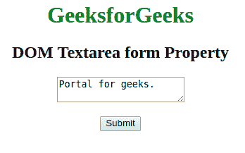
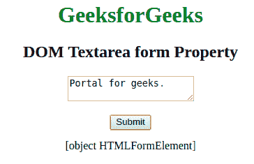

# HTML | DOM Textarea 表单属性

> 原文:[https://www . geesforgeks . org/html-DOM-textarea-form-property/](https://www.geeksforgeeks.org/html-dom-textarea-form-property/)

**DOM 文本区域表单属性**用于通过引用包含文本区域的表单来**返回**文本区域。如果代码成功运行或者文本区域在表单中，它将返回表单对象。
**语法:**

```html
textareaObject.form

```

**返回值:**

*   如果表单中不包含文本区域，则返回包含该文本区域的表单的引用。
*   否则，如果表单中不包含文本区域，则返回空值。

**示例:** HTML 程序来说明 **DOM Textarea 表单属性**。

## 超文本标记语言

```html
<!DOCTYPE html>
<html>

<head>
    <title>DOM Textarea form Property</title>
    <style>
        body {
            text-align: center;
        }

        h1,
        h2 {
            text-align: center;
        }
    </style>
</head>

<body>
    <h1 style="color: green;">
            GeeksforGeeks
    </h1>

    <h2>
        DOM Textarea form Property
    </h2>

    <form id="Geeks">
        <textarea id="GFG" name="GFG_text">
            Portal for geeks.
        </textarea>
    </form>

    <br>
    <button type="button"
            onclick="myGeeks()">
      Submit
  </button>
    <p id="sudo"> </p>
    <script>
        function myGeeks() {
            var x = document.getElementById("GFG").form;
            document.getElementById("sudo").innerHTML = x;

        }
    </script>
</body>

</html>
```

**输出:**
**点击按钮前:**



**点击按钮后:**



**注意:**上面的代码打印表单类型的对象。要打印表单的 id 或名称，请仅在脚本中使用**表单. id** 而不是**表单**。
**支持的浏览器:***文本区表单属性*支持的浏览器如下:

*   谷歌 Chrome
*   微软公司出品的 web 浏览器
*   火狐浏览器
*   歌剧
*   旅行队