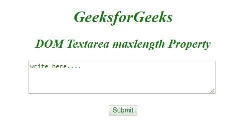
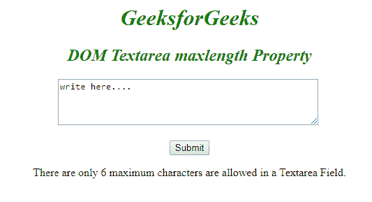
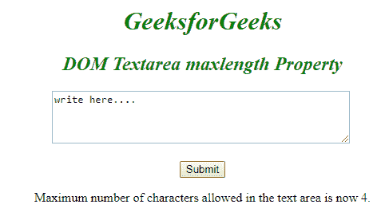

# HTML | DOM Textarea 最大长度属性

> 原文:[https://www . geesforgeks . org/html-DOM-textarea-maxlength-property/](https://www.geeksforgeeks.org/html-dom-textarea-maxlength-property/)

**DOM Textarea maxlength 属性**用于*设置*或*返回*Textarea 字段的 **maxlength 属性的值。它指定元素中允许的最大字符数。**

**语法:**

*   用于返回 maxLength 属性:

    ```html
    textareaObject.maxLength
    ```

*   用于设置最大长度属性:

    ```html
    textareaObject.maxLength = number
    ```

**属性值**

*   **数字:**指定文本区域元素中允许的最大字符数。

**返回值:**返回一个数值，代表文本区域字段中允许的最大字符数。

**示例-1:** HTML 程序说明如何**返回 maxlength 属性**。

```html
<!DOCTYPE html>
<html>

<body>
    <center>
        <h1 style="color:green;
                   font-style:italic;">
          GeeksforGeeks
      </h1>

        <h2 style="color:green;
                   font-style:italic;">
          DOM Textarea maxlength Property
      </h2>

        <textarea rows="4" 
                  cols="50"
                  id="GFG" 
                  maxlength="6">
          write here....
      </textarea>
        <br>
        <br>

        <button onclick="myGeeks()">
          Submit
      </button>

        <p id="sudo"></p>

        <script>
            function myGeeks() {

             // Return max length allowed in the textarea field.
             var x = document.getElementById("GFG").maxLength;

             document.getElementById("sudo").innerHTML =
             "There are only " + x + " maximum characters" +
             "are allowed in a Textarea Field.";;
            }
        </script>
</body>

</html>
```

**输出:**

**点击按钮前:**


**点击按钮后:**


**示例-2 :** HTML 程序说明如何**设置 maxlength 属性**。

```html

<!DOCTYPE html>
<html>

<body>
    <center>
        <h1 style="color:green;
                   font-style:italic;">
          GeeksforGeeks
      </h1>

        <h2 style="color:green;
                   font-style:italic;">
          DOM Textarea maxlength Property
      </h2>

      <textarea rows="4" 
                cols="50" 
                id="GFG"
                maxlength="6">
        write here....
      </textarea>
      <br>
      <br>

      <button onclick="myGeeks()">
        Submit
      </button>

        <p id="sudo"></p>

        <script>
            function myGeeks() {

                // Set maxlength 4.
                var x =
                document.getElementById("GFG").maxLength = "4"

                document.getElementById("sudo").innerHTML =
                  "Maximum number of characters allowed"+
                "in the text area is now 4.";
                "4"
            }
        </script>
  </center>
</body>

</html>
```

**输出:**

**点击按钮前:**


**点击按钮后:**


**支持的浏览器:***文本区最大长度属性*支持的浏览器如下:

*   谷歌 Chrome
*   微软公司出品的 web 浏览器
*   火狐浏览器
*   歌剧
*   旅行队