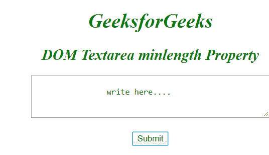
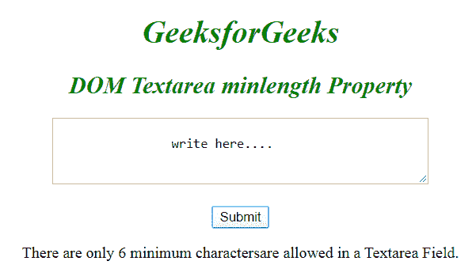
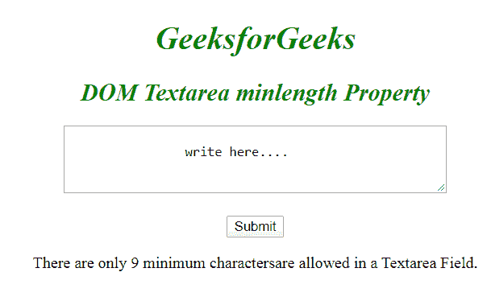

# HTML | DOM textarea 最小长度属性

> 原文:[https://www . geesforgeks . org/html-DOM-textarea-min length-property/](https://www.geeksforgeeks.org/html-dom-textarea-minlength-property/)

**HTML DOM 文本区最小长度属性**用于*设置*或*返回*文本区字段**最小长度属性的值**。它指定元素中允许的最小字符数。
**语法:**

*   它返回最小长度属性。

```html
textareaObject.minLength
```

*   它用于设置 minLength 属性。

```html
textareaObject.minLength = number
```

**房产价值:**

*   **number:** 它指定 textarea 元素中允许的最小字符数。

**返回值:**返回一个数值，代表文本区域字段中允许的最小字符数。
**例 1:** HTML 程序说明如何**返回 minlength 属性**。

## 超文本标记语言

```html
<!DOCTYPE html>
<html>

<body>
    <center>
        <h1 style="color:green;
                font-style:italic;">
            GeeksforGeeks
        </h1>

        <h2 style="color:green;
                font-style:italic;">
            DOM Textarea minlength Property
        </h2>

        <textarea rows="4" cols="50"
                id="GFG" minlength="6">
            write here....
        </textarea>
        <br><br>

        <button onclick="myGeeks()">
            Submit
        </button>

        <p id="sudo"></p>

        <script>
            function myGeeks() {

                // Return max length allowed in the textarea field.
                var x = document.getElementById("GFG").minLength;

                document.getElementById("sudo").innerHTML =
                    "There are only " + x + " minimum characters" +
                    "are allowed in a Textarea Field.";;
            }
        </script>
</body>

</html>
```

**输出:**

*   **点击按钮前:**



*   **点击按钮后:**



**示例:** HTML 程序说明如何**设置 minlength 属性**。

## 超文本标记语言

```html
<!DOCTYPE html>
<html>

<body>
    <center>
        <h1 style="color:green;
                font-style:italic;">
            GeeksforGeeks
        </h1>

        <h2 style="color:green;
                font-style:italic;">
            DOM Textarea minlength Property
        </h2>

        <textarea rows="4" cols="50" id="GFG" minlength="6">
            write here....
        </textarea>
        <br>
        <br>

        <button onclick="myGeeks()">
            Submit
        </button>

        <p id="sudo"></p>

        <script>
            function myGeeks() {

                // Return max length allowed in the textarea field.
                var x = document.getElementById("GFG").minLength = "9";

                document.getElementById("sudo").innerHTML =
                    "There are only " + x + " minimum characters" +
                    "are allowed in a Textarea Field.";;
            }
        </script>
</body>

</html>
```

**输出:**

*   **点击按钮前:**


*   **点击按钮后:**

