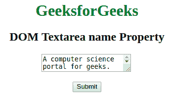
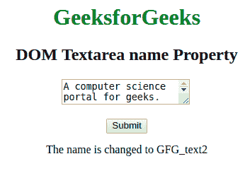
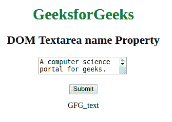

# HTML | DOM Textarea 名称属性

> 原文:[https://www . geesforgeks . org/html-DOM-textarea-name-property/](https://www.geeksforgeeks.org/html-dom-textarea-name-property/)

**DOM 文本区名称属性**用于**设置**或**返回**文本区字段的**名称属性**的值。

**语法:**

*   它用于返回 name 属性。

    ```html
    textareaObject.name
    ```

*   用于设置名称属性:

    ```html
    textareaObject.name = text/value 
    ```

**属性值:**

*   **文本:**指定文本区域的名称。

**返回值:**以字符串的形式返回文本区域的名称。

**示例-1:** HTML 程序来说明设置 **DOM 文本区名称属性**。

```html
<!DOCTYPE html>
<html>

<head>
    <title>
      DOM Textarea name Property
  </title>
    <style>
        body {
            text-align: center;
        }

        h1,
        h2 {
            text-align: center;
        }
    </style>
</head>

<body>
    <h1 style="color: green;"> 
            GeeksforGeeks 
        </h1>

    <h2> 
            DOM Textarea name Property 
        </h2>

    <textarea id="GFG" 
              name="GFG_text">
        A computer science portal for geeks.
    </textarea>

    <br>
    <br>
    <button type="button"
            onclick="myGeeks()">
      Submit
  </button>
    <p id="sudo"> </p>
    <script>
        function myGeeks() {
            var x = 
                document.getElementById(
              "GFG").name = "GFG_text2";

            document.getElementById("sudo").innerHTML =
                "The name is changed to " + x;
        }
    </script>
</body>

</html>
```

**输出:**

**点击按钮前:**


**点击按钮后:**


**示例-2:** HTML 程序来说明返回 **DOM Textarea 名称属性**。

```html
<!DOCTYPE html>
<html>

<head>
    <title>
      DOM Textarea name Property
  </title>
    <style>
        body {
            text-align: center;
        }

        h1,
        h2 {
            text-align: center;
        }
    </style>
</head>

<body>
    <h1 style="color: green;"> 
            GeeksforGeeks 
        </h1>

    <h2> 
            DOM Textarea name Property 
        </h2>

    <textarea id="GFG" name="GFG_text">
        A computer science portal for geeks.
    </textarea>
    <br>
    <br>
    <button type="button"
            onclick="myGeeks()">Submit</button>
    <p id="sudo"> </p>
    <script>
        function myGeeks() {
            var x = document.getElementById(
              "GFG").name;
            document.getElementById(
              "sudo").innerHTML = x;
        }
    </script>
</body>

</html>
```

**输出**
**点击按钮前:**


**点击按钮后:**


**支持的浏览器:***文本区名称属性*支持的浏览器如下:

*   谷歌 Chrome
*   微软公司出品的 web 浏览器
*   火狐浏览器
*   歌剧
*   旅行队