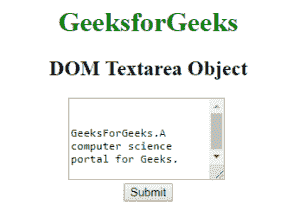
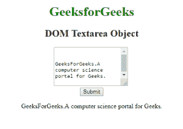
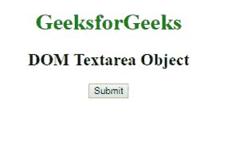
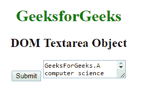

# HTML | DOM Textarea 对象

> 原文:[https://www.geeksforgeeks.org/html-dom-textarea-object/](https://www.geeksforgeeks.org/html-dom-textarea-object/)

HTML DOM 中的 Textarea 对象用来表示 HTML textarea 元素。可以使用 getElementById()方法访问 textarea 元素。
**语法:**

```html
document.getElementById("ID"); 
```

其中标识被分配给<textarea>元素。<br/> <strong>房产价值:</strong> <br/></textarea>

*   **自动对焦:**用于设置或返回页面加载时元素是否应该对焦。
*   **cols:** 用于设置或返回 textarea Element 的 cols 属性的值。
*   **defaultvalue:** 用于设置或返回 textarea 元素的 defaultvalue。
*   **disabled:** 用于设置或返回 textarea 元素的 disabled 属性的值。
*   **表单:**用于返回包含 textarea 字段的表单的引用。
*   **maxLength:** 用于设置或返回 textarea 字段的 maxattribute 的值。
*   **名称:**用于设置或返回 textarea 字段的名称属性。
*   **占位符:**用于设置或返回文本区域字段的占位符属性的值。
*   **readOnly:** 用于返回 textarea 字段的 readOnly 属性值。
*   **必选:**用于设置或返回提交表单前是否必须填写输入元素。
*   **类型:**行:用于设置或返回 textareafield 类型属性的值
*   **值:**用于设置或返回文本区域字段的内容。
*   **换行:**用于返回 textarea 字段的换行属性值。

**方法:**

*   **选择():**用于选择文本区域字段中的所有全部内容。

**示例 1:** 本示例描述了访问< textare >元素的 getElementById()方法。

## 超文本标记语言

```html
<!DOCTYPE html>
<html>
    <head>
        <title>
            HTML DOM Textarea Object
        </title>
    </head>

    <body style = "text-align:center">

        <h1 style = "color: green;">
            GeeksforGeeks
        </h1>

        <h2>DOM Textarea Object</h2>

        <!--A disabled textarea-->
        <textarea id = "myGeeks">
            GeeksForGeeks.A computer science portal for Geeks.
        </textarea>

        <br>

        <button onclick = "Geeks()">
            Submit
        </button>

        <p id = "sudo"></p>

        <script>
            function Geeks() {
                var x = document.getElementById("myGeeks").value;
                document.getElementById("sudo").innerHTML = x;
            }
        </script>
    </body>
</html>                   
```

**输出:**
**之前点击按钮:**



**点击按钮后:**



**示例 2:** 可以使用 *document.createElement* 方法创建文本区域对象。

## 超文本标记语言

```html
<!DOCTYPE html>
<html>
    <head>
        <title>
            HTML DOM Textarea Object
        </title>
    </head>

    <body style = "text-align:center">    

        <h1 style = "color: green;">
            GeeksforGeeks
        </h1>

        <h2>DOM Textarea Object</h2>

        <button onclick = "Geeks()">
            Submit
        </button>

        <!-- script to create textarea -->
        <script>
            function Geeks() {

                // textarea tag is created
                var g = document.createElement("TEXTAREA");

                var f = document.createTextNode(
                "GeeksForGeeks.A computer science portal for Geeks.");

                g.appendChild(f);
                document.body.appendChild(g);
            }
        </script>
    </body>
</html>                   
```

**输出:**
**之前点击按钮:**



**点击按钮后:**



**支持的浏览器:***DOM Textarea 对象*支持的浏览器如下:

*   谷歌 Chrome
*   微软公司出品的 web 浏览器
*   火狐浏览器
*   歌剧
*   旅行队