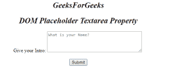

# HTML | DOM Textarea 占位符属性

> 原文:[https://www . geesforgeks . org/html-DOM-textarea-placeholder-property/](https://www.geeksforgeeks.org/html-dom-textarea-placeholder-property/)

**DOM 文本区域占位符属性**用于**设置**或**返回**文本区域字段的占位符属性值。它指定一个简短的提示，描述输入字段/ textarea 的预期值。在 textarea 中输入值之前显示的短消息或提示。

**语法:**

*   它用于返回占位符属性。

    ```html
    textareaObject.placeholder
    ```

*   它用于设置占位符属性。

    ```html
    textareaObject.placeholder = text
    ```

**属性值:**

*   **文本:**显示描述输入期望值的消息/短提示。

**返回值:**它返回一个字符串值，该值代表描述输入字段预期值的简短提示。

**示例-1:** 本示例说明如何设置文本区域占位符属性。

```html
<!DOCTYPE html>
<html>

<body>
    <center>
        <h1 style="font-size:25px;
                   font-style:italic;">
          GeeksForGeeks
      </h1>

        <h2 style="font-size:25px;
                   font-style:italic;">
          DOM Placeholder Textarea Property
      </h2>
      Give your Intro:

      <textarea id="GFG" 
                rows="4"
                cols="40"
                placeholder="Write something here"
                " about yourself...">
      </textarea>
      <br>
      <br>

      <button onclick="myGeeks()">Submit</button>

        <script>
            function myGeeks() {

                // Set hint for input field.
                document.getElementById(
                  "GFG").placeholder = 
                  "What is your Name?";
            }
        </script>
    </center>

</body>

</html>
```

**输出:**

*   **点击按钮前:**
    
*   **After Clicking On Button:**
    

    **示例-2:** 本示例说明如何返回 textarea 占位符属性。

    ```html
    <!DOCTYPE html>
    <html>

    <body>
        <center>
            <h1 style="font-size:25px;
                       font-style:italic;">
              GeeksForGeeks
          </h1>

            <h2 style="font-size:25px;
                       font-style:italic;">
              DOM Placeholder Textarea Property
          </h2> 
          Give your Intro:
            <textarea id="GFG"
                      rows="4" 
                      cols="40"
                      placeholder=
                      "Write something here 
                       about yourself...">
          </textarea>
            <br>
            <br>

            <button onclick="myGeeks()">
              Submit
          </button>

            <p id="sudo"></p>

            <script>
                function myGeeks() {

                    // Short hint in input field.
                    var x = document.getElementById(
                      "GFG").placeholder;

                    document.getElementById(
                      "sudo").innerHTML = x;
                }
            </script>
    </body>

    </html>
    ```

    **输出:**

    *   **点击按钮前:**
        
    *   **点击按钮后:**
        

    **支持的浏览器:***文本区占位符属性*支持的浏览器如下:

    *   谷歌 Chrome
    *   微软公司出品的 web 浏览器
    *   火狐浏览器
    *   歌剧
    *   旅行队