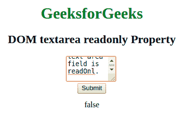

# HTML | DOM Textarea 只读属性

> 原文:[https://www . geesforgeks . org/html-DOM-textarea-readonly-property/](https://www.geeksforgeeks.org/html-dom-textarea-readonly-property/)

**DOM 文本区只读属性**用于**设置**或**返回***文本区的文本是否为只读*。如果它是只读的，则不能修改内容，但可以复制。
**语法:**

*   它用于返回 readOnly 属性。

```html
textareaObject.readOnly
```

*   它用于设置 readOnly 属性。

```html
textareaObject.readOnly = true|false
```

**属性值:**

*   **true:** 定义文本区域为 readOnly。
*   **false:** 为默认值。它定义文本区域不是只读的，可以更改。

**返回值:**以布尔值的形式返回 readOnly 属性的值，即真或假。
**示例-1:** 本示例说明如何**设置文本区只读属性**。

## 超文本标记语言

```html
<!DOCTYPE html>
<html>

<head>
    <title>DOM textarea readonly Property</title>
</head>

<body style="text-align:center">
    <h1 style="color: green;">
      GeeksforGeeks
  </h1>
    <h2>DOM textarea readonly Property</h2>

    <!-- Assigning id to textarea. -->
    <textarea id="GFG_ID" rows="3" cols="10" name="Geeks" >
This text is wrapped in the text area field.
    </textarea>
    <br>

    <button onclick="myGeeks()">Submit</button>
    <p id = "GFG" > </p>

    <script>
        function myGeeks() {   
          // Set the readOnly property.
          var x = 
           document.getElementById(
           "GFG_ID").readOnly = true;

          document.getElementById("GFG").innerHTML = 
           "The value is set to " + x;
        }
    </script>
</body>

</html>
```

**输出:**
**点击按钮前:**


**点击按钮后:**


**示例-2 :** 本示例说明了如何**返回文本区域只读属性**。

## 超文本标记语言

```html
<!DOCTYPE html>
<html>

<head>
    <title>DOM textarea readOnly Property</title>
</head>

<body style="text-align:center">

    <h1 style="color: green;">GeeksforGeeks</h1>
    <h2>DOM textarea readonly Property</h2>

    <!-- Assigning id to textarea. -->
    <textarea id="GFG_ID" rows="3" cols="10" name="Geeks" readonly>
This text in the text area field is readOnly.
    </textarea>
    <br>

    <button onclick="myGeeks()">Submit</button>

    <p id="sudo"></p>

    <!-- Return the value of the readOnly property -->
    <script>
        function myGeeks() {

            var x = 
            document.getElementById(
            "GFG_ID").readOnly;

            document.getElementById("sudo").innerHTML = x;
        }
    </script>
</body>

</html>
```

**输出:**
**点击按钮前:**


**点击按钮后:**



**支持的浏览器:***文本区只读属性*支持的浏览器如下:

*   谷歌 Chrome
*   微软公司出品的 web 浏览器
*   火狐浏览器
*   歌剧
*   旅行队