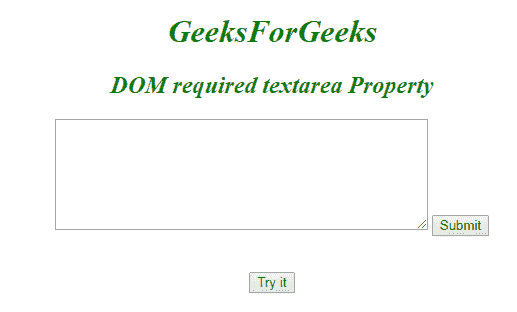
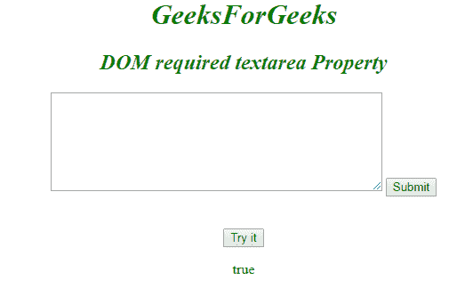
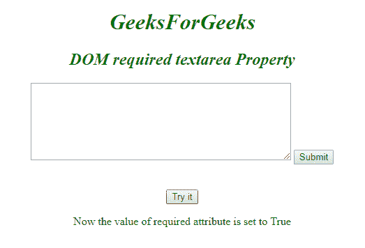

# HTML | DOM Textarea 必需属性

> 原文:[https://www . geesforgeks . org/html-DOM-textarea-required-property/](https://www.geeksforgeeks.org/html-dom-textarea-required-property/)

**DOM Textarea 必需属性**用于*设置*或*返回*提交表单前是否必须填写输入元素。此属性用于反映所需的属性。
**语法:**

*   用于返回所需属性:

```html
textareaObject.required
```

*   用于设置所需属性:

```html
textareaObject.required = true|false
```

**房产价值**

*   **true:** 指定提交表单前必须填写 textarea 字段。
*   **假:**有默认值。它指定 textarea 字段不是表单的必需部分。

**返回值:**返回一个布尔值，表示在提交表单之前必须填写**文本区字段**。
**示例-1:** 在说明如何**返回所需属性**的 HTML 程序中。

## 超文本标记语言

```html
<!DOCTYPE html>
<html>

<head>
    <title>DOM required textarea Property</title>
    <style>
        h1,
        h2 {
            color: green;
            font-style: italic;
        }

        body {
            text-align: center;
        }
    </style>
</head>

<body>
    <h1>GeeksForGeeks</h1>
    <h2>DOM required textarea Property</h2>

    <form action="/action_page.php">
        <textarea id="GFG"
                  rows="7"
                  cols="50"
                  name="comment"
                  required>
        </textarea>

        <input type="submit">
    </form>
    <br>
    <br>

    <button onclick="myGeeks()">
      Try it
    </button>

    <p id="sudo"></p>

    <script>
        function myGeeks() {

            // Return Textarea property
            var x =
            document.getElementById("GFG").required;

            document.getElementById("sudo").innerHTML =
              x;
        }
    </script>
</body>

</html>
```

**输出:**
**点击试用按钮前:**



**点击试用按钮后:**



**示例-2:** 在说明如何**设置所需属性**的 HTML 程序中。

## 超文本标记语言

```html
<!DOCTYPE html>
<html>

<head>
    <title>DOM required textarea Property</title>
    <style>
        h1,
        h2 {
            color: green;
            font-style: italic;
        }

        body {
            text-align: center;
        }
    </style>
</head>

<body>
    <h1>GeeksForGeeks</h1>
    <h2>DOM required textarea Property</h2>

    <form action="/action_page.php">
        <textarea id="GFG"
                  rows="7"
                  cols="50"
                  name="comment">
        </textarea>

    <input type="submit">
    </form>
    <br>
    <br>
    <button onclick="myGeeks()">
      Try it
    </button>

    <p id="sudo"></p>

    <script>
        function myGeeks() {

           // Set Textarea property.
           var x =
           document.getElementById("GFG").required =
            true;

            document.getElementById("sudo").innerHTML =
             "Now the value of required attribute is set to True";
        }
    </script>
</body>

</html>
```

**输出:**
**点击按钮前:**


**点击按钮后:**



**支持的浏览器:**支持的浏览器*所需文本区属性*如下:

*   谷歌 Chrome
*   微软公司出品的 web 浏览器
*   火狐浏览器
*   歌剧
*   旅行队