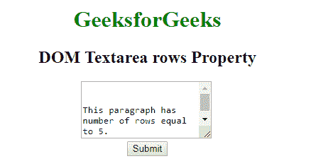
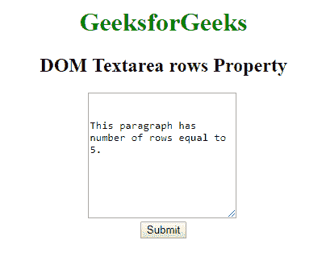
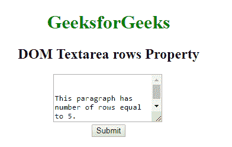
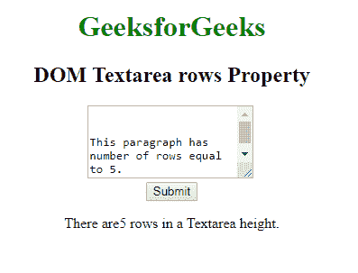

# HTML | DOM Textarea 行属性

> 原文:[https://www . geesforgeks . org/html-DOM-textarea-rows-property/](https://www.geeksforgeeks.org/html-dom-textarea-rows-property/)

**DOM 文本区域行属性**用于*设置*或*返回*文本区域字段的行属性的值。rows 属性指定控件的可见文本行数，即要显示的行数。

**语法:**

*   用于返回行属性:

    ```html
    textareaObject.rows
    ```

*   用于设置行属性:

    ```html
    textareaObject.rows = number
    ```

**属性值:**

*   **number:** 它指定 textarea 字段中可见的行数。

**返回值:**返回一个数值，代表包含字符的文本区域字段的高度。

**示例-1:** HTML 程序来说明设置 **DOM 文本区域行属性。**

```html
<!DOCTYPE html>
<html>

<head>
    <title>DOM Textarea rows Property</title>
    <style>
        h1,
        h2 {
            text-align: center;
        }
    </style>
</head>

<body style="text-align:center;">
    <h1 style="color: green;"> 
            GeeksforGeeks 
        </h1>

    <h2> 
            DOM Textarea rows Property 
        </h2>

    <!-- Below id assigned to Textarea Element -->
    <textarea id="GFG" rows="5" cols="23">
        This paragraph has number of rows equal to 5.
    </textarea>
    <br>

    <button type="button" 
            onclick="myGeeks()">
      Submit
    </button>

    <script>
        function myGeeks() {

         // Access textarea element.
          document.getElementById("GFG").rows = 
              "10";
        }
    </script>
</body>

</html>
```

**输出:**

**点击按钮前:**


**点击按钮后:**


**示例-2:** HTML 程序来说明返回 **DOM Textarea 行的属性。**

```html
<!DOCTYPE html>
<html>

<head>
    <title>DOM Textarea rows Property</title>
    <style>
        h1,
        h2 {
            text-align: center;
        }
    </style>
</head>

<body style="text-align:center;">
    <h1 style="color: green;"> 
            GeeksforGeeks 
        </h1>

    <h2> 
            DOM Textarea rows Property 
        </h2>

    <!-- Below id assigned to Textarea Element -->
    <textarea id="GFG" rows="5" cols="23">
        This paragraph has number of rows equal to 5.
    </textarea>
    <br>
    <button type="button" onclick="myGeeks()">Submit</button>
    <p id="sudo"></p>
    <script>
        function myGeeks() {

            // Return number of rows in the textare.
            var x = document.getElementById("GFG").rows;
            document.getElementById("sudo").innerHTML = 
              "There are" + x + " rows in a Textarea height.";
        }
    </script>
</body>

</html>
```

**输出:**

**点击按钮前:**


**点击按钮后:**


**支持的浏览器:***文本区行属性*支持的浏览器如下:

*   谷歌 Chrome
*   微软公司出品的 web 浏览器
*   火狐浏览器
*   歌剧
*   旅行队