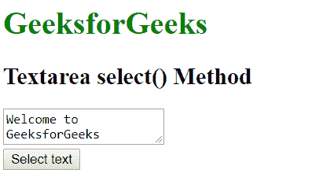
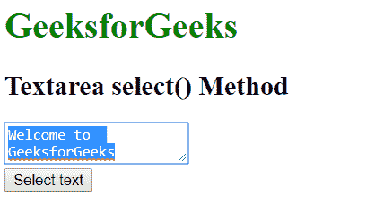

# HTML | DOM Textarea select()方法

> 原文:[https://www . geesforgeks . org/html-DOM-textarea-select-method/](https://www.geeksforgeeks.org/html-dom-textarea-select-method/)

HTML DOM 中的 select()方法用于选择文本区域或包含文本字段的<input>元素的全部内容。

**语法:**

```html
elementObject.select()
```

**参数:**此方法不接受任何参数。

**返回值:**不返回值。

**示例:**

```html
<!DOCTYPE html>
<html>
    <head>
        <title>
            DOM Textarea select() Method
        </title>
    </head>

    <body>

        <h1 style="color: green;">
            GeeksforGeeks
        </h1>

        <h2>
            Textarea select() Method
        </h2>
        <textarea type = "text" 
            id = "text">Welcome to GeeksforGeeks
        </textarea>

        <br>
        <button onclick = "Geeks()">
            Select text
        </button>

        <script>
            function Geeks() {
                var doc = document.getElementById('text');
                doc.select();
            }
        </script>

    </body>
</html>                    
```

**输出:**
**之前点击按钮:**

**之后点击按钮:**


**支持的浏览器:**T2 DOM textarea select()方法支持的浏览器如下:

*   苹果 Safari
*   谷歌 Chrome
*   火狐浏览器
*   歌剧
*   微软公司出品的 web 浏览器