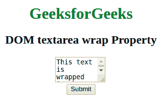
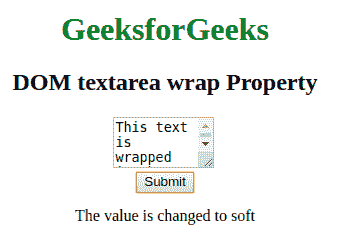
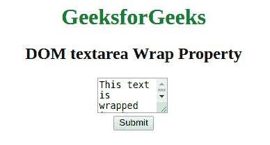
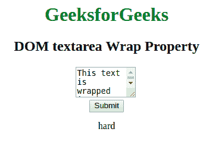

# HTML | DOM Textarea 换行属性

> 原文:[https://www . geesforgeks . org/html-DOM-textarea-wrap-property/](https://www.geeksforgeeks.org/html-dom-textarea-wrap-property/)

**DOM 文本区环绕属性**用于**设置**或**返回**文本区的环绕属性的*值。它描述了提交表单时文本的包装方式。*

**语法:**

*   它用于返回 wrap 属性。

    ```html
    textareaObject.wrap
    ```

    *   It is used to set the wrap property.

    ```html
    textareaObject.wrap = soft|hard
    ```

    **属性值:**

    *   **soft:** 定义文本不换行。这是默认值。
    *   **硬:**定义文字被包裹。这里必须提到 cols 属性。

    **返回值:**以字符串的形式返回文本在文本区域中的换行方式。

    **示例-1:** 本示例说明如何**设置文本区域环绕属性**。

    ```html
    <!DOCTYPE html>
    <html>

    <head>
        <title>
          DOM textarea wrap Property
      </title>
    </head>

    <body style="text-align:center">
        <h1 style="color: green;">
          GeeksforGeeks
      </h1>
        <h2>
          DOM textarea wrap Property
      </h2>

        <!-- Assigning id to textarea. -->
        <textarea id="GFG_ID" 
                  rows="3"
                  cols="10" 
                  name="Geeks" 
                  wrap="hard">
            This text is wrapped in the text area field.
        </textarea>
        <br>

        <button onclick="myGeeks()">
          Submit
      </button>
        <p id="GFG"> </p>
        <script>
            function myGeeks() {
                // Set the wrap property.
                var x =
                    document.getElementById(
                      "GFG_ID").wrap = "soft";

                document.getElementById("GFG").innerHTML =
                    "The value is changed to " + x;
            }
        </script>
    </body>

    </html>
    ```

    **输出:**
    **点击按钮前:**
    

    **点击按钮后:**
    

    **示例-2:** 本示例说明如何**返回文本区域环绕属性**。

    ```html
    <!DOCTYPE html>
    <html>

    <head>
        <title>
          DOM textarea Wrap Property
      </title>
    </head>

    <body style="text-align:center">

        <h1 style="color: green;">GeeksforGeeks</h1>
        <h2>DOM textarea Wrap Property</h2>

        <!-- Assigning id to textarea. -->
        <textarea id="GFG_ID"
                  rows="3" 
                  cols="10" 
                  name="Geeks" 
                  wrap="hard">
            This text is wrapped in the text area field.
        </textarea>
        <br>

        <button onclick="myGeeks()">
          Submit
      </button>

        <p id="sudo"></p>

        <!-- Return the value of the wrap property -->
        <script>
            function myGeeks() {

                var x = 
                    document.getElementById(
                      "GFG_ID").wrap;

                document.getElementById(
                  "sudo").innerHTML = x;
            }
        </script>
    </body>

    </html>
    ```

    **输出:**

    **点击按钮前:**
    

    **点击按钮后:**
    

    **支持的浏览器:***文本区环绕属性*支持的浏览器如下:

    *   谷歌 Chrome
    *   微软公司出品的 web 浏览器
    *   火狐浏览器
    *   歌剧
    *   旅行队