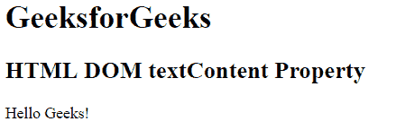

# HTML | DOM textContent 属性

> 原文:[https://www . geesforgeks . org/html-DOM-text content-property/](https://www.geeksforgeeks.org/html-dom-textcontent-property/)

HTML 中的 **textContent** 属性用于设置或返回指定节点及其所有后代的文本内容。这个属性非常类似于 nodeValue 属性，但是这个属性返回所有子节点的文本。
**语法:**

*   用于设置节点的文本。

```html
node.textContent = text
```

*   它用于返回节点的文本。

```html
node.textContent
```

**属性值:**它包含包含节点内容的单值文本。

**返回值:**返回一个字符串值，代表特定节点节点及其所有后代的文本内容。
**例 1:**

## 超文本标记语言

```html
<!DOCTYPE html>
<html>
    <head>
        <title>
            HTML DOM textContent Property
        </title>
    </head>
    <body>
        <h1>GeeksforGeeks</h1>
        <h2>HTML DOM textContent Property</h2>

        <button id = "geeks" onclick = "MyGeeks()">
            Submit
        </button>

        <p id = "sudo"></p>

        <script>
        function MyGeeks() {
            var text =
                document.getElementById("geeks").textContent;
            document.getElementById("sudo").innerHTML = text;
        }
        </script>
    </body>
</html>                    
```

**输出:**
**之前点击按钮:**


**点击按钮后:**


**例 2:**

## 超文本标记语言

```html
<!DOCTYPE html>
<html>
    <head>
        <title>
            HTML DOM textContent Property
        </title>
    </head>
    <body>
        <h1>GeeksforGeeks</h1>
        <h2>HTML DOM textContent Property</h2>

        <p id = "geeks" onclick = "MyGeeks()">
            Hello Geeks!
        </p>

        <script>
            function MyGeeks() {
                document.getElementById("geeks").textContent
                = "Welcome to GeeksforGeeks!";
            }
        </script>
    </body>
</html>                    
```

**输出:**
**点击前文字:**



**点击后文字:**


**支持的浏览器:**T2 DOM textContent 属性支持的浏览器如下:

*   谷歌 Chrome 1.0
*   Internet Explorer 9.0
*   火狐浏览器
*   歌剧
*   旅行队